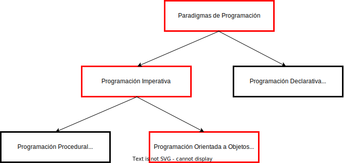
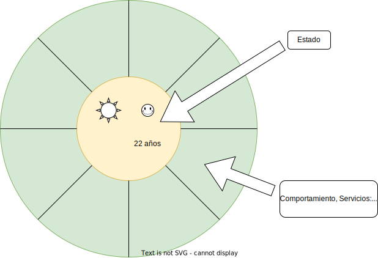
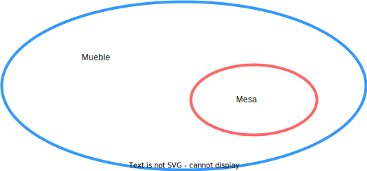
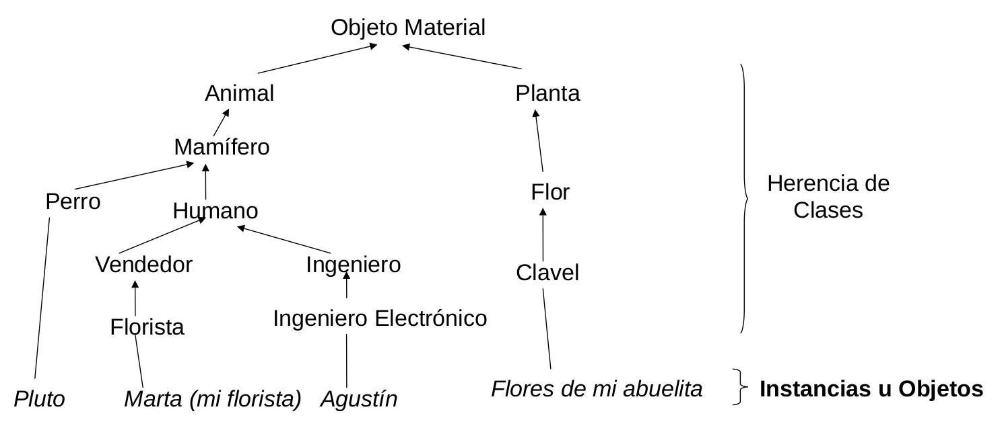
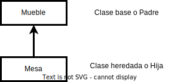

# ELO329 - Diseño y Programación Orientados a Objetos
## Plan del curso
Agustín González
Patricio Olivares

---

# Paradigmas de Programación


---

# Paradigmas de Programación: Historia
- Los computadores parten cableados por hardware.
- Luego se introduce la programación en binario.
- Se desarrolla el lenguaje assembler (lenguaje de máquina).
- Se desarrollan los lenguajes de alto nivel siguiendo dos paradigmas:
    - **Programación Imperativa**: donde la computación es descrita vía sentencias que cambian el estado del programa. Es una secuencia de comandos para el computador. **El programa señala cómo se llega a la solución** Ej. C, C++, Java, Python.
    - **Programación declarativa**: la computación es descrita según su lógica sin indicar su control de flujo. **Se indica qué se debe hacer, no el cómo se debe hacer**. Ej. HTML (HyperText Markup Language), CSS (Cascading Style Sheet), las fórmulas en planillas electrónicas.

---

# Programación Imperativa

- Parte con la **Programación por Procedimientos** (Procedural Programming) donde la **computación es descrita con el apoyo de llamados a procedimientos o funciones**. El programador debe encontrar la secuencia de instrucciones que resuelven la tarea, hace uso de procedimientos para mejorar la estructura y claridad del programa. Se dice que el lenguaje es estructurado (sin go-to).
- Luego evoluciona a la **Programación Orientada a Objetos**: El programador debe encontrar *objetos*; es decir, entidades que *tienen comportamiento, estado* y pueden interactuar con otros objetos. **La computación se describe como la interacción de estos objetos**. Representa un intento por hacer los programas más cercanos a la forma como pensamos y nos relacionamos con el mundo. Este enfoque permite programas más naturales, más simples de construir bien y de entender.

---

# Programación Orientada a Objetos

- Para crear la solución a un problema, el programador identifica los *objetos del mundo real* que intervienen en el problema.
- En el programa se crean *objetos de software* que modelan lo relevante de los objetos reales del problema. Además se crean objetos sintéticos (artificiales) que sean necesarios para estructurar una solución coherente y natural. Ej. un dron:
    - Tiene un estado: su altura, orientación, su rapidez, etc.
    - Tiene un comportamiento: lo podemos subir, hacer girar, aterrizar, etc.
- Ejecutar alguna "Tarea 2" de años previos. Ej. [Tarea2_1s21](http://profesores.elo.utfsm.cl/~agv/elo329/1s20/Assignments/T2.pdf), [solución con JavaFX](http://profesores.elo.utfsm.cl/~agv/elo329/1s20/Assignments/DroneJavaSource.tar)

---

# Objetos de Software

- Los *objetos de software* modelan dos aspectos de los objetos o entes reales: su *estado* y su *comportamiento*.
- Luego, *cada objeto de software tendrá un estado y cierto comportamiento*.
- Además todo objeto de software tendrá un nombre o identificador para poder referirnos a él.
- Similar ocurre en C++ con:
```c++
    int i = 20; /* integer i */
```
- `int` nos da una pista sobre qué cosas podemos hacer con `i`.
- `i` es un nombre necesario para diferenciarlo de otros enteros.
- Si `i=20`, entonces podemos decir que su estado es 20.

---

# Objetos de Software



Salvo excepciones, la interacción con el objeto solo debería ser vía los servicios de cada objeto.

---

# Ejemplo de Objeto

- Un punto en el espacio $R2$
- Podemos representar un punto de varias formas: coordenadas cartesianas, polares, etc. Es así como podemos almacenar el estado de un punto como dos reales $(x, y)$, o dos reales $(r ,\theta)$.
- Independientemente de la forma como representemos un punto, nos puede interesar conocer:
    - El ángulo que forma el rayo del origen hasta el punto con el eje de abscisas.
    - Su distancia al origen.
    - Su distancia a otro punto, etc.

---

# Un Punto en Java

- Una vez hecha la descripción para un punto, en Java podemos hacer cosas como: 

```java
    Punto p = new Punto(); /* en el origen,no se ve explícito */
```
- Con esto creamos un punto y le asignamos un *nombre o identificador* para referirnos a él. Su *estado inicial es definido junto con su creación.*
- Luego podríamos hacer cosas del tipo:
```java
    p.x(); /* para obtener su coordenada */
    p.getDistance(); /* distancia al origen del punto p */
    p.getDistance(p2); /* distancia entre p y otro punto p2 */
```

---

# Clases

- Cada objeto es único, pero generalmente hay varios del mismo tipo. Hay varios puntos, por ejemplo.
- Cuando modelamos la realidad, lo hacemos reconociendo las categorías de objetos que comparten sus características. Ej: *En un sistema podemos tener varios resortes, o personas, pero todos siguen el mismo patrón de comportamiento.*
- Las clases definen las características de los objetos. Son la *descripción para una categoría de objetos de características comunes, estableciendo sus atributos y operaciones*. Ej. 
    - Atributo: fecha nacimiento para persona, constante elástica para resorte; 
    - Operaciones: obtener edad de persona, fuerza ejercida para resorte.
- Tendremos tantas clases como tipos de objetos distintos identificados en un problema.

---

# Clases

- Una clase debe definir todos los *atributos* (para almacenar el estado) y los *comportamientos* de ese tipo de objetos que sean relevantes para el problema.
- El *comportamiento* (también llamados *servicios* o *mensajes*) que puede exhibir, ofrecer o recibir un objeto, lo expresamos como funciones en el sentido clásico de los lenguajes. Para diferenciarlos, en orientación a objetos *se les llama métodos*. En C++ también se les llama "función miembro".
- Así, cada objeto posee, además de su nombre o identificador, *atributos* y *métodos* que son definidos en la clase a la cual él pertenece.

---

# Ejemplo de Clase en Java

```java
class Punto {
    // nombre de la clase
    private int x,y;
    // atributos para almacenar el estado.
    public Punto(){
        // método, define estado inicial, al momento de
        x=y=0;
        // ser creado, lo llamamos método constructor.
    }
    // fin de constructor
    public Punto(int _x, int _y){ // otro constructor
        x=_x;
        y=_y;
    }
    public int getX(){
        return x;
    }
    public int getY(){
        return y;
    }
    public boolean equals(Punto p){
        if (p==null) return false;
        // Objeto p no creado aún.
        return ((x==p.getX()) && (y==p.getY()));
    }
}
```

---

# Discusión en equipos

Responda la pregunta y luego seleccione a integrante para exponer respuesta al curso en menos de 2 minutos.

Se desea modelar una **calculadora básica** como un objeto.
- ¿Cuál o cuáles serían posibles estados de la calculadora?
- ¿Qué comportamientos debería tener esta calculadora?
- ¿Qué tipo de dato o variable usaría para almacenar algún estado de la calculadora?

---

# Jerarquía de clases

- Es común que los objetos del mundo real estén relacionados de la forma **"es un"**. Al ver la definición de casi cualquier cosa notamos:
    - Mesa: *es un* mueble que se compone de ...
    - Chileno: *es una* persona natural de Chile ...
- Es natural identificar jerarquías donde una clase comparte características comunes con otra clase y además posee algo propio que la distingue.


---

# Jerarquía de Clases: Herencia

- Los Lenguajes Orientados a Objetos permiten definir clases a partir de clases ya definidas.
- El hecho que el conocimiento de una categoría más general es también aplicable a una categoría específica se conoce como *Herencia*.
- Decimos que la clase *Mesa* hereda los atributos de la clase *Mueble*, y ésta hereda de la clase *Objeto_inanimado*, etc.
- Según el problema, se establece una Jerarquía de clases.

---

# Ejemplo: Jerarquía de Clases


---

# Vocabulario
- Así como Agustín es un caso específico de la clase *Persona*, podemos decir que Agustín es un ejemplo o *instancia* de persona.
- En OO decimos que los objetos son *instancias* de una clase. Al crear una instancia de un clase, creamos un objeto. Es común usar *instanciar* como verbo.
- *Herencia*: es un tipo de relación entre dos clases en la cual se crea una clases a partir de otra (Java) u otras (C++) clases ya creadas. Así *reutilizamos* el trabajo hecho previamente.

---

# Subtipos
- Cuando una clase hereda de otra, hablamos de clases heredada o hija y la otra es clase base o padre.

- Es interesante ver que si en alguna situación requerimos un mueble y tenemos una mesa, estaríamos bien. Por ejemplo, si queremos bloquear una puerta, podemos usar un mueble; si tenemos una mesa cerca, ésta puede hacer el trabajo.
- Subtipo es el uso de un objeto en lugar de uno de jerarquía mayor. Mesa es *subtipo* de Mueble.

---

# Subtipos

- Ejemplo: En la USM hay estudiantes, son personas. Además hay estudiantes de Ing. Civil Electrónica, Telemática etc.
- Podemos identificar varias clases: *Persona*, *Estudiante*, *EstudianteTelemática*, *EstudianteElectrónica*.
- Los Lenguajes OO permiten que si en un método se usa una instancia de *Persona* como argumento, también es válido poner una instancia de Estudiante o una de EstudianteElectrónica.
- Esto es posible gracias a que los lenguajes OO permiten sustituir una instancia por otra proveniente de un subtipo.

---

# Polimorfismo

- **Según la RAE**: Cualidad de lo que tiene o puede tener distintas formas
- En OO esto ocurre de varias maneras.
- La idea básica es usar el mismo nombre para referirse a cosas similares. Supongamos la clase Lista: ¿Por qué debería darle un nombre distinto al método **ordenar** cuando ordenamos una lista de reales `float` o de enteros `int`?
- Cuando un estudiante ocupa el lugar de una persona (por subtipo), también decimos que hay polimorfismo. El estudiante es también persona (dos formas).

---

# Características de los POO

Los lenguajes OO se caracterizan por:
- Permiten expresar *herencia*: relación entre clases que permite reusar la definición de un tipo de objeto para definir otro tipo de objeto.
- *Subtipos*: Si un objeto a tiene todo lo requerido por otro objeto b, entonces podemos usar *a* donde se esperaba *b*.
- Permiten expresar *abstracción*: es decir, detalles de una implementación pueden ocultarse en el programa. Para usar una clase no necesitamos conocer cómo está implementada. La *implementación de una clase* es el código de sus métodos y los atributos que tiene.
- Ligado dinámico: Cuando un método es invocado en un objeto, el código ejecutado (método) es determinado en tiempo de ejecución según el objeto que lo recibe. Esto conduce a que una misma invocación puede responder de manera distinta según quién la reciba.

---

# Diseño/Implementación Orientado a Objetos

- El Diseño OO involucra identificar los conceptos importantes de la solución y usar objetos para estructurar la manera cómo esos conceptos son reflejados en un sistema de software.
- *Se trata de modelar el sistema como la interacción de objetos inter-actuantes.*
- Involucra
    - Identificar los objetos a un nivel de abstracción dado.
    - Identificar la semántica (comportamiento) de esos objetos.
    - Identificar la relación entre los objetos.
    - Implementar los objetos.
- Es un proceso Iterativo.