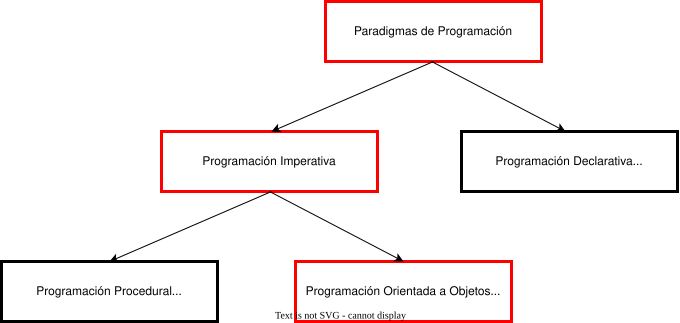
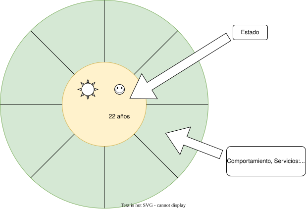
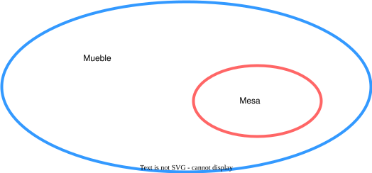
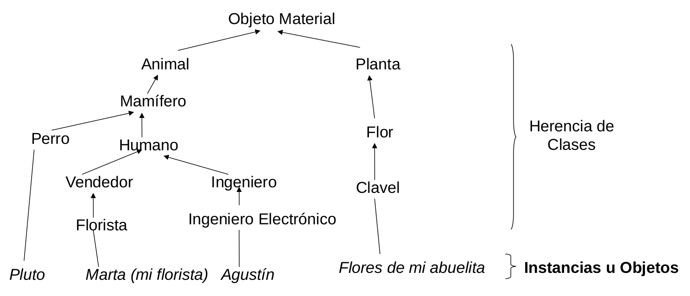
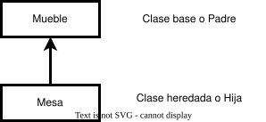

# ELO329 - Diseño y Programación Orientados a Objetos
## 01 - Conceptos de POO
Agustín González
Patricio Olivares

---

# Paradigmas de Programación


---

# Paradigmas de Programación: Historia
- Al principio, los computadores se "programaban" por hardware.
- Después apareció la programación en binario (0 y 1).
- Luego llegaron lenguajes de máquina y assembler.

Idea clave: cada etapa buscó hacer más fácil decirle al computador qué hacer.

---

# Paradigmas de Programación: Historia
- Con los lenguajes de alto nivel, aparecen dos miradas principales:
  - **Programación imperativa**: damos instrucciones paso a paso.  
    El foco está en **cómo** se resuelve.
  - **Programación declarativa**: describimos el resultado esperado.  
    El foco está en **qué** se quiere lograr.

Ejemplos:
- Imperativa: C, C++, Java, Python
- Declarativa: HTML, CSS, fórmulas en planillas

---

# Programación Imperativa

- Parte fuerte de este paradigma: **programación por procedimientos**.
- Pensamos la solución como una secuencia de pasos y funciones.
- El programador define el orden exacto de ejecución.

Analogía rápida: es como seguir una receta línea por línea.

---

# Programación Imperativa

- Evoluciona hacia **Programación Orientada a Objetos (POO)**.
- Ahora modelamos entidades con:
  - **estado**
  - **comportamiento**
  - **interacción con otros objetos**

Idea central: la solución se describe como colaboración entre objetos.

---

# Programación Orientada a Objetos

- Para resolver un problema:
  - identificamos objetos relevantes del mundo real,
  - y los modelamos como objetos de software.
- También pueden existir objetos "inventados" para organizar mejor la solución.

Ejemplo: un dron  
- Estado: altura, orientación, rapidez.  
- Comportamiento: subir, girar, aterrizar.

---

# Objetos de Software

Todo objeto de software tiene:
- **estado** (datos internos),
- **comportamiento** (métodos),
- **nombre o identificador** (cómo lo referimos en código).

Ejemplo simple:
```c++
int i = 20;
```
- `int` sugiere qué operaciones son válidas,
- `i` es su identificador,
- `20` representa su estado actual.

---

# Objetos de Software



Regla práctica: interactuar con un objeto usando sus métodos, no tocando sus detalles internos.

---

# Ejemplo de Objeto

- Objeto: **punto en el plano R2**.
- Podemos guardar su estado como:
  - coordenadas cartesianas `(x, y)`, o
  - coordenadas polares `(r, theta)`.

Sin importar la representación, queremos servicios como:
- ángulo respecto del eje x,
- distancia al origen,
- distancia a otro punto.

---

# Un Punto en Java

```java
Punto p = new Punto(); // punto creado en el origen
```

- Al crear el objeto, queda con estado inicial.
- Luego podemos pedir servicios:

```java
p.getX();
p.getDistance();
p.getDistance(p2);
```

---

# Clases

- Un objeto es único, pero casi siempre existen muchos objetos parecidos.
- Para eso usamos **clases**: una descripción común para una categoría de objetos.

Analogía: una clase es como un molde; cada objeto es una pieza creada con ese molde.

---

# Clases

Una clase define:
- **atributos** (estado),
- **operaciones o métodos** (comportamiento).

Ejemplos:
- Persona: atributo `fechaNacimiento`, método `getEdad()`.
- Resorte: atributo `constanteElastica`, método `getFuerza()`.

---

# Clases

- Cada objeto de una clase tendrá:
  - sus propios valores de atributos,
  - acceso a los métodos definidos por la clase.
- En POO, los servicios de un objeto se expresan como métodos.
- En C++, también se usa el término **función miembro**.

---

# Ejemplo de Clase en Java

```java
class Punto {
    private int x, y;
    public Punto() {
        x = 0;
        y = 0;
    }
    public Punto(int _x, int _y) {
        x = _x;
        y = _y;
    }
    public int getX() { return x; }
    public int getY() { return y; }

    public boolean equals(Punto p) {
        if (p == null) return false;
        return (x == p.getX()) && (y == p.getY());
    }
}
```

---

# Discusión en equipos

Desafío relámpago (2 minutos):

Modelen una **calculadora básica** como objeto.
- ¿Qué estados podría tener?
- ¿Qué comportamientos mínimos debería ofrecer?
- ¿Qué tipo de dato usarían para guardar el resultado actual?

Luego, una persona por equipo comparte la propuesta.

---

# Jerarquía de clases

- Muchas relaciones del mundo real son del tipo **"es un"**:
  - Mesa **es un** mueble.
  - Chileno **es una** persona.
- En software, eso se traduce en jerarquías de clases.



---

# Jerarquía de Clases: Herencia

- Los lenguajes OO permiten crear clases a partir de otras clases.
- A esto le llamamos **herencia**.
- Sirve para reutilizar atributos y métodos ya definidos.

Ejemplo:
- `Mesa` puede heredar de `Mueble`,
- `Mueble` puede heredar de una clase más general.

---

# Ejemplo: Jerarquía de Clases


---

# Vocabulario

- Si Agustín pertenece a la clase `Persona`, entonces Agustín es una **instancia**.
- Crear un objeto a partir de una clase se llama **instanciar**.
- **Herencia**: construir una clase nueva desde otra ya existente para reutilizar trabajo.

---

# Subtipos

- Si una clase hereda de otra, aparece una relación de **subtipo**.
- Clase derivada: hija.
- Clase de origen: base o padre.



Intuición: si te piden un `Mueble`, una `Mesa` puede servir.

---

# Subtipos

Ejemplo en contexto USM:
- `Persona`
- `Estudiante`
- `EstudianteElectronica`
- `EstudianteTelematica`

Si un método recibe `Persona`, se puede pasar un `Estudiante`.
Eso funciona por la relación de subtipo.

---

# Polimorfismo

- Según la RAE: algo que puede tomar distintas formas.
- En OO, una misma interfaz puede operar sobre objetos distintos pero relacionados.

Ejemplos:
- Método `ordenar()` para listas de diferentes tipos.
- Usar un `Estudiante` donde se esperaba una `Persona`.

---

# Características de los POO

Los lenguajes OO destacan porque permiten:
- **Herencia**: reutilizar definiciones entre clases.
- **Subtipos**: usar un objeto más específico donde se esperaba uno más general.

---

# Características de los POO

- **Abstracción**: usar una clase sin conocer sus detalles internos.
- **Ligado dinámico**: el método ejecutado se decide en tiempo de ejecución según el objeto real que recibe el mensaje.

Resultado: código más flexible y extensible.

---

# Diseño/Implementación Orientado a Objetos

Diseñar en OO implica modelar la solución como objetos que interactúan.

Pasos típicos:
- Identificar objetos relevantes.
- Definir su comportamiento.
- Definir relaciones entre objetos.
- Implementar y refinar.

Es un proceso **iterativo**: se mejora en ciclos.

