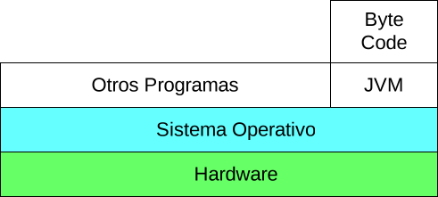
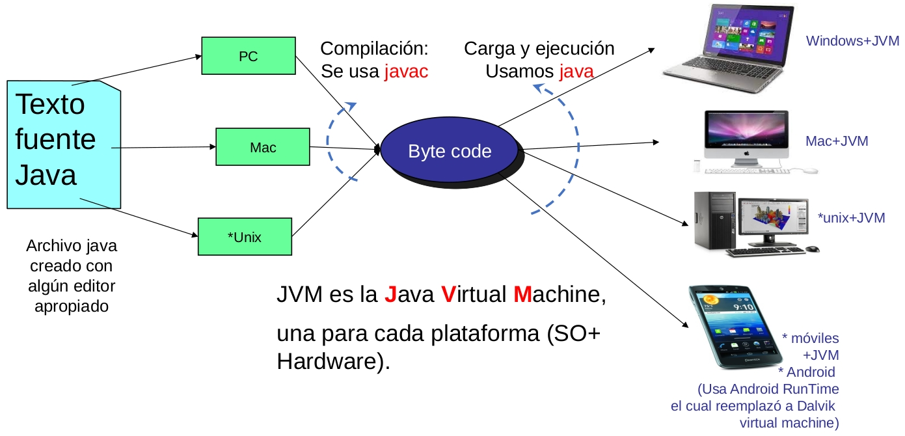

# ELO329 - Diseño y Programación Orientados a Objetos
## Introducción a Java
Agustín González
Patricio Olivares

---

# Plataforma recomendada: Linux

En esta asignatura se trabajará con **Linux** como plataforma principal. Si bien el funcionamiento de Java permite ejecutarse en diversas plataformas (Windows, macOS), se recomienda el uso de Linux para garantizar la compatibilidad y coherencia en el desarrollo y ejecución de programas.

**Importante:** Los estudiantes que opten por trabajar en otras plataformas serán responsables de asegurar que su código funcione correctamente en un entorno Linux.

---
# Plataforma recomendada: Linux
## **Alternativas para usar Linux en otros entornos**
- **WSL (Windows Subsystem for Linux)**: Permite ejecutar un entorno Linux dentro de Windows sin necesidad de una máquina virtual.
- **Máquinas Virtuales**: Usando software como VirtualBox o VMware, se puede instalar una distribución de Linux y ejecutarla dentro de otro sistema operativo.
- **Arranque dual (Dual Boot)**: Instalación de Linux en una partición del disco junto con otro sistema operativo.
- **Live USB**: Uso de una distribución Linux desde una unidad USB sin necesidad de instalación en el disco.
---

# Java: Motivaciones  de su origen

Por los años 90 los desarrolladores de Java buscaban ofrecer lenguaje independiente de:
- Tipo de computador
- Sistema operativo
- Sistema de ventanas (win32, Motif, etc.)
- Obs: Cuando Java aparece (1995) no existía Qt (herramienta para desarrollar software gráfico en C++ para múltiples plataformas).

---
# Java: Motivaciones  de su origen
- C++ permite el uso de punteros, muy útiles para electrónicos y telemáticos, pues corresponde a direcciones de la memoria física. Como éstos generaban dificultades para muchos, Java los elude.
- Java hace un manejo de memoria que libera al programador de esa preocupación. No hay "fugas de memoria" o "memory leaks"

---

# Independiente del Computador y del Sistema Operativo

- Esto se logra por el uso de una *Máquina Virtual Java (Java Virtual Machine).*
- Una máquina virtual es una abstracción de una máquina real. La máquina virtual es generada por software.
- ¿Han usado programas emuladores de consolas de juegos?
- ¿Han usado programas emuladores de PC dentro de un PC? Así podemos tener varios Sistemas operativos corriendo concurrentemente en la misma máquina. Ej: Vmware, VirtualBox.
- Este concepto también es aplicable a sistemas operativos donde es posible crear la apariencia de tener varias máquinas independientes (jaulas o jails)

---

# Java Virtual Machine (JVM)



- Para cada combinación hardware+SO se ha creado una máquina virtual Java (es un programa más).
- Un programa compilado Java (byte code) corre "igual" en todas las máquinas virtuales.
- Ver: [https://www.oracle.com/java/](https://www.oracle.com/java/).

---

# Edición, compilación y ejecución


---

# Edición, compilación y ejecución
Compilación y ejecución de un programa Java en Linux se realiza por **consola de comandos**:

---

# Edición, compilación y ejecución
## Actividad
1. **Escribir el código fuente en un archivo `.java`**
   ```bash
   nano FirstSample.java
   ```
   Luego, copiar el siguiente código (no es necesario entenderlo, cópienlo con fe!):
   ```java
   public class FirstSample {
       public static void main(String[] args) {
           System.out.println("¡Hola, Java!");
       }
   }
   ```
   Guardar y salir (`CTRL + X`, `Y`, `Enter`).

---

# Edición, compilación y ejecución

2. **Compilar el código fuente**
   ```bash
   javac FirstSample.java
   ```
   Esto generará un archivo `FirstSample.class` con el código en *bytecode*.

---

# Edición, compilación y ejecución

3. **Ejecutar el programa**
   ```bash
   java FirstSample
   ```
   **Salida esperada:**
   ```
   ¡Hola, Java!
   ```

---

# Trabajando con Java
## Definición e instalación de Java y Editor de texto.
- Java
  - Descargar desde: [https://www.oracle.com/java/technologies/javase/jdk21-archive-downloads.html](https://www.oracle.com/java/technologies/javase/jdk21-archive-downloads.html)
  - Puede instalar `open-jdk` (proyecto open source del JDK de Java) en distribuciones Linux basadas en Debian por consola:
    ```bash
    sudo apt install openjdk-21-jdk
    ```
  - Verificar instalación con:
    ```bash
    java --version
    ```
---

# Trabajando con Java
## Definición e instalación de Editor de texto.
- Editor:
    - Para cosas simples usar alguno de su conveniencia; por ejemplo, [sublime](https://www.sublimetext.com/index2).
    
    
---
# Trabajando con Java    
- Una vez que sabe cómo compilar y correr usando la consola, se sugiere usar un ambientes integrados de Desarrollo (IDE) como:
    - [Visual Studio Code](https://code.visualstudio.com/)
    - [Intelli J](https://www.jetbrains.com/es-es/idea/)
    - [jGrasp](https://www.jgrasp.org/)
    - [Eclipse](https://eclipseide.org/)
    - [Netbeans](https://netbeans.apache.org/front/main/index.html)
- Un buen editor debería ayudar a indentar su programa, colorear palabras reservadas, etc.
- **No usar notepad** o similar.

---

# Configuración recomendada: IntelliJ + JDK 21 + Linux

Para facilitar el desarrollo en Java, se recomienda utilizar la siguiente configuración:

- **Sistema Operativo:** Linux
- **JDK:** Java Development Kit (JDK) 21 (versión LTS-Long Term Support)
- **IDE:** IntelliJ IDEA

**Nota:** Configuraciones con otros IDEs como *NetBeans*, *Eclipse*, o *Visual Studio Code* también son posibles, pero la compatibilidad y soporte en la asignatura se enfocará en la configuración recomendada.

---

# Componentes de Java

- Java tiene muchas [componentes](http://manuales.elo.utfsm.cl/manuales/jdk-8u40/index.html) (componentes para Java versión 8)
- Nosotros usaremos algunas, tales como : java, javac, javadoc, JavaFX, etc.
- Para aprender más, ver [Documentación JDK 21](https://docs.oracle.com/en/java/javase/21/) (Java Development Kit).