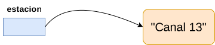

# ELO329 - Diseño y Programación Orientados a Objetos
## Introducción al lenguaje Java
Agustín González
Patricio Olivares

---

# Mi Primer Programa en Java

- Como en C y C++, en Java todo programa parte por la "función" `main`. Como en Java no existen funciones "al aire" como en los lenguajes no orientados a objetos, `main` **debe** ser un método de alguna clase.
- Corolarios
    - Todo programa Java debe tener al menos una clase.
    - Todo programa Java debe tener el método `main` definido en alguna clase

#### **`FirstSample.java`**
```java
public class FirstSample {
    public static void main(String[ ] args) {
        System.out.println("Hello, Sansanos!");
    }
}
```
---

# Mi Primer Programa en Java

- Se compila así: `$javac FirstSample.java`
- En Java el nombre de un archivo fuente y la clase accesible desde otros archivos y definida en él deben llamarse igual (archivo agrega extensión `.java`).
- Se usa así para identificar del archivo que contiene la clase buscada. ¿Qué pasa si los fuentes están en otra carpeta?
- En tiempo de ejecución en general debemos invocar los métodos de un objeto usando el nombre o referencia al objeto (`main` es una excepción). Ej. 
```java
Punto p = new Punto(); // Para instanciar un punto
p.equals(otroPunto); // Para invocar un método
```

---

# Mi Primer Programa Java

- Un método también puede ser estático, lo acompaña el calificar `static`. Este puede ser invocado directamente usando el **nombre de la clase**. Los métodos estáticos pueden entenderse como *métodos de la clase en general* y no de un objeto específico; por ejemplo, funciones matemáticas como `abs()` para valor absoluto (está en clase `Math`).

---

# Mi Primer Programa en Java

- Al ejecutar: `$ java FirstSample`, la máquina virtual java busca el archivo `FirstSample.class` e invoca `FirstSample.main(<aquí pone los argumentos de la línea de comandos>)`.
- Así como una clase tiene **métodos estáticos** (son lo más parecido a una función tipo C/Python), también puede tener **atributos estáticos**. Este es el caso del atributo de nombre `out` de la clase `System`.
- `System.out` es un objeto al cual le podemos invocar el método `println(String s)`.
- Ver [documentación de java](https://docs.oracle.com/en/java/javase/21/).

---

# Sobre los nombres de archivos fuentes

- `javac` accede y compila el archivo dado como argumento. Se generarán tantos archivos `.class` como clases hayan sido definidas en él.
- Para cada clase `A` instanciada en el programa, `javac` busca el archivo `A.class` correspondiente. Si no lo haya, compila el archivo `A.java` que debe estar en alguno de los directorios listados en la variable de ambiente `CLASSPATH` (por omisión directorio actual). Si `A.class` existe pero es más antiguo que `A.java`, vuelve a compilar `A.java`.
- Al ejecutar un programa `P`, java busca el archivo `P.class` e inicia todo desde su método `main`. Si el programa hace referencia a otras clases, sus correspondientes `.class` deben estar en algún directorio listado en `CLASSPATH`.

---

# Ejecución de Programas Java
- Para ejecutar programas en Windows, lance una consola (ejecutando cmd/power shell) y corra en esta los comandos de compilación y ejecución.
- En Linux/MacOS lance una consola y ejecute los comandos para compilar y ejecutar su programa.
- Obviamente, esto se puede hacer más simple usando un ambiente de
desarrollo integrado (IDE: Integrated Development Environment, como IntelliJ, VSCode (estos dos primeros recomendados, pero puede usar otros), Jgrasp, Eclipse, NetBeans, etc.

---

# Aspectos básicos: Tipos primitivos 
Son 8 y no son objetos, todo lo demás sí.

- Booleano 
    - `boolean`: Verdadero (`true`) y Falso (`false`).
- Enteros (4)
    - `int`: 4 bytes
    - `short`: 2 bytes
    - `long`:  8 bytes
    - `byte`: 1 byte
- Punto flotante (2)
    - `float`: 4 bytes (6-7 dígitos significativos)
    - `double`: 8 bytes (15 dígitos siginificativos)

---

# Aspectos básicos: Tipos primitivos 
- Caracter
    - `char`: Usa una codificación conocida como **Unicode**.
        - Usa dos bytes (distinto de ASCII que usa 7 bits).
        - Diseñado para internacionalización.
        - Comillas simples: 'a', 'A', '!', '1', ...
        - Forma hexadecimal `'\u000'` (Unicode backspace)
        - El byte menos significativo corresponde al "ASCII" de 8 bits.
        - Posee caracteres no visibles.

---
# Aspectos básicos: Tipos primitivos 

| <!-- -->    | <!-- -->    |
|-------------|-------------|
|`'\b'`|backspace|
|`'\t'`|tab|
|`'\n'`|linefeed/salto de línea|
|`'\r'`|return|
|`'\"'`|double quote/comillas dobles|
|`'\''`|single quote/comillas simples|
|`'\\'`|backslash|

---

# Constantes
- Se usa la palabra reservada `final`. Ej. 
```java 
public final float CM_PER_INCH=2.54;
```
- Si deseamos crear solo una instancia de esta constante para todos los objetos de una clase, usamos:
```java
public class Constante {
    public static final float CM_PER_INCH=2.54;
    ...
}
```
- Para acceder al valor: 
```java
Constante.CM_PER_INCH;
```

---

# Cambios de tipo automáticos


---

# Operadores y su precedencia
<style scoped>
table {
  font-size: 12px;
}
</style>
|Precedencia|Operador|Asociatividad|
|-----------|--------|-------------|
|alta| `[]` `.` `()`|&rarr;|
||`!` `~` `++` `--` `+` `-` `(<tipo o clase>)` `new`|&larr;|
||`*` `/` `%`|&rarr;|
||`+` `-`|&rarr;|
||`<<` `>>` `>>>`|&rarr;|
||`<` `<=` `>` `>=` instance of|&rarr;|
||`==` `!=`|&rarr;|
||`&`|&rarr;|
||`^`|&rarr;|
||&#124;|&rarr;|
||`&&`|&rarr;|
||&#124;&#124;|&rarr;|
||`?:`|&larr;|
|baja|`=` `+=` `-=` `*=` `/=` `%=` `&=` &#124;= `^=` `<<=` `>>=` `>>>=`|&larr;|

---

# String

- Java tiene una clase pre-definida llamada `String`.
- Todos los string son **objetos** y su comportamiento está dado por la clase `String`. Ver en ella todas las operaciones para Strings.
- El operador + concatena strings. Si uno de los operandos no es string, Java lo convierte a string y luego lo concatena. Ej.
```java
int trece = 13;
String estacion = "Canal"+trece // Canal13
```

---

# String

- Para comparar dos strings, usar el método `equals()`. De otra manera comparamos **referencias**.
- El identificador de todo objeto es una **referencia** al objeto ("dirección"), no el objeto mismo.



---

# Entrada y Salida de Texto

- La salida de texto por consola es simple haciendo uso del objeto `System.out`. Es decir, atributo `out` de la clase `System`.
- Hasta la versión 1.4 la entrada de texto era bastante engorrosa. Esto se simplifica en V1.5 (o Java versión 5).
- Formas gráficas de entrada y salida se verán más adelante.
- Las clases principales a estudiar son:
    - `Java.io.PrintStream` (desde Java 1.0), y
    - `Java.util.Scanner` (desde Java 1.5)

---

# Salida de datos simple a consola

- Desde la versión 1.0 de Java existe la clase `java.io.PrintStream`. `System.out` es instancia de esta.
- Algunos métodos son:
    - `print(Object obj)`: invoca método `toString` de `obj` e imprime resultado.
    - `print(String s)`: imprime `String s`.
    - `print(tipo_básico b)`: imprime el valor de b
    - `println(String s)`: Imprime s seguido de newline/salto de línea.

---

# Entrada de datos simples por consola

- El objeto especial para efectuar entrada de datos es `System.in`; sin embargo, este no ofrece métodos cómodos (es instancia de `InputStream`).
- Para facilitar la entrada de datos se creó, a partir de la versión 1.5, la clase `Scanner`, del paquete `java.util`, la cual trabaja como envoltorio o recubriendo (wrapper) la clase `InputStream`.
- `Scanner` tiene varios métodos convenientes para la entrada de datos.
- Ver ejemplo: `InputExample.java`

---

# Métodos de Java.util.Scanner

- Ver [documentación](https://docs.oracle.com/en/java/javase/21/docs/api/java.base/java/util/Scanner.html)
- Algunos métodos
    - `hasNext()`: ¿hay más datos en entrada?
    - `next()`: retorna próximo token
    - `hasNextType()`: `Type` es tipo básico. Verdadero si hay tal dato a continuación. `Type` puede ser `boolean`, `Byte`, `Double`, `Float`, `Int`, `Long` y `Short`.
    - `nextType()`: retorna el dato del tipo `Type` a continuación.
    - Ver también: `hasNextLine()`, `nextLine()`, `findInLine(String s)`.

---

# Entrada de datos simples vía gráfica

- Otra forma de ingresar datos es vía la clase `JOptionPane`, en
particular uno de sus métodos: `JOptionPane.showInputDialog(promptString)`. Este llamado retorna el string ingresado por el usuario.
- Ver ejemplo: `InputTest.java`

---

# Sentencias: condicional `if`

- Sintáxis
```java
if(exp){
    statements1;
}else {
    statements2;
}
```
- Ejemplo:
```java
if(a>b){
    x = a;
}else{ // else es opcional
    x = b;
}
```

---

# Sentencias: bucles `while`
- Sintáxis
```java
while(exp){
    statements;
}
```
- Ejemplos
```java
while (a>b) a = x[i++];
```
```java
while ( x < 0 ) {
    x = z.getX( ... );
    y = y + x;
}
```
Bucle `while` puede evitar la primera iteración si la expresión no es verdadera. 

---

# Sentencias: bucles `do-while`

- Sintáxis
```java
do{
    statements;
}while(exp);
```
- Ejemplos
```java
do a = x[i++]; while( a>z );
```
```java
do {
    x = z.getX( ... );
    y = y + x;
} while ( x > 0 );
```
Bucle `do-while` siempre hace **al menos** una iteración.

---

# Sentencias: bucles `for`

- Sintáxis
```java
for(exp1;exp2;exp3){ 
    statements; 
}
```
- Ejemplos
```java
for(int k=0; k<n; k++){ s;} // en este caso k no está definida después.
// Equivalente a la siguiente expresión while
int k=0;
while( k<n ) { s; k++; } // aquí k sí existe aún después del loop.
```
- Podemos poner cualquier expresión en las partes del bucle for, pero es buena práctica sólo inicializar, probar condición de término y actualizar la variable de
control.
- Patrón estándar para `n` iteraciones!

---

# Sentencias: bucles `for` mejorado

- Diseñado para el manejo de arreglos y Colecciones.    
- Las colecciones son clases ya definidas en Java que permiten agrupar varios objetos en estructuras tales como listas, colas, etc.
- La versión mejorada del for permite hacer bucles más compactos y fáciles de leer. Su estructura se desprende del siguiente ejemplo:
```java
class EnhancedForDemo {
    public static void main(String[] args){
        int[] numbers = {1,2,3,4,5,6,7,8,9,10};
        for (int item : numbers) {
            System.out.println("Count is: " + item);
        }
    }
}
```

---

# Sentencias: `switch`
- Condicional múltiple
- Sintáxis
```java
switch(exp1){
    case x1: s1; break; // si no ponemos break, sigue s2.
    case x2: s2; break;
    default: s3;
}
```
- Ejemplo:
```java
switch(x) {
    case 1: y = a; break;
    case 2: y = b; break;
    default: y = c;
}
```

---

# Clases para tipos de datos primitivos

- Estas clases son envoltorios (Wrappers)
- Crean objetos para los tipos estándares.
- `java.lang`
    - `Boolean`
    - `Integer`
    - `Long`
    - `Character`
    - `Float`
    - `Double`

---
# Clases para tipos de datos primitivos

- Un método importante en estas clases nos permite transformar un string que contiene números en un tipo básico (como `atoi()` en C).
- Ejemplo
```java
int a = Integer.parseInt(“3425”); // hace que a tome el valor 3425.
```
- Se usó en ejemplo `InputTest.java`

---

# Arreglos en Java
- Los arreglos almacenan una colección de valores de igual tipo, su acceso es vía un índice entero *(0<= índice < max)*.
- Declaración de una variable arreglo de enteros:
```java
int [] a; // hasta aquí sólo tenemos en identificador
a = new int[100]; //recién ahora tenemos los datos
```
- Todos los arreglos son objetos de tamaño constante, definidos en tiempo de ejecución.

---

# Arreglos en Java

- Además de sus datos, todos los arreglo tienen el atributo constante `length`, el cual entrega el largo del arreglo.
```java
int [] a = {3,5,7,11,17}; //creación con primeros valores.
int [] a = new int [20]; // sólo creación
for (int i=0; i<a.length; i++) // otra forma de inicializarlo
    a[i] = i;
```

---

# Arreglos son objetos

```java
int [] a = new int [5];
Int [] b=a;
```

- Ojo los cambios en `b`, afectarán `a` y viceversa. Ej.
```java
a[2]=3; // hará que b[2] sea 3.
```

---

# Arreglos multidimensionales
```java
int [] [] matriz = {{1,2,3},{4,5,6},{7,8,9}};
```
- Acceso 
```java
int a = matriz[1,2]; // será el 6 porque parten de 0
```
- Los arreglos multidimensionales son en realidad arreglos de arreglos. Como curiosidad, podrían no ser cuadrados.

---

# Arreglos multidimensionales
Ejemplo
```java
for (int n=0; n<triangular.length; n++){
    triangular[n]=new int[n+1];
    for (int j=0; j < triangular[n].length; j++)
        triangular[n][j] = n+j;
}
```
