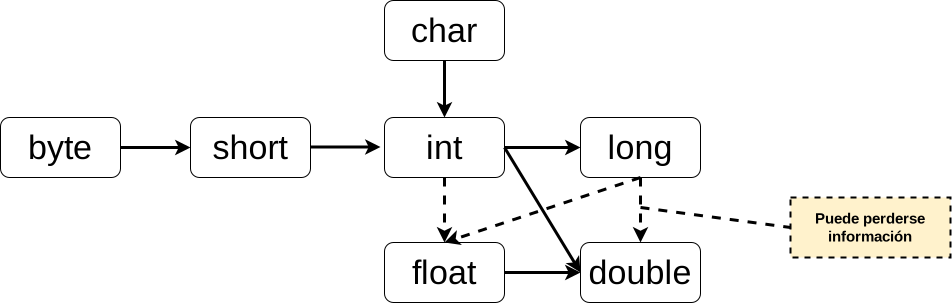
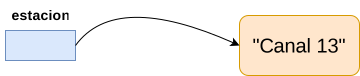
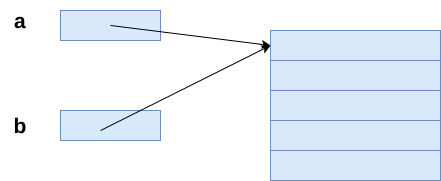
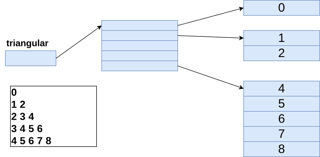

# ELO329 - Diseño y Programación Orientados a Objetos
## Introducción al lenguaje Java
Agustín González
Patricio Olivares

---
# Mi Primer Programa en Java

- Al igual que en lenguajes como C y C++, en Java todo programa parte por una *función* `main`. Sin embargo, como en Java no existen funciones *independientes*, `main` **debe** ser un método de alguna clase.
- Corolarios
    - Todo programa Java debe tener al menos una clase.
    - Todo programa Java debe tener el método `main` definido en alguna clase

---
# Mi Primer Programa en Java

#### **`FirstSample.java`**
```java
public class FirstSample { // Definimos una clase llamada FirstSample
    public static void main(String[] args) { // Método main: punto de entrada
        System.out.println("Hello, Sansanos!"); // Imprime en pantalla
    }
}
```

---
# Mi Primer Programa en Java
## Compilación y ejecución de un programa en Java

1. **Compilación:**
   ```bash
   javac FirstSample.java
   ```
   Esto genera un archivo `FirstSample.class`, que contiene el **bytecode** listo para ser ejecutado en la Máquina Virtual de Java (JVM).

---
# Mi Primer Programa en Java
## Estructura de archivos
```
📁 ProyectoJava/
   ├── FirstSample.java  <-- Código fuente
   ├── FirstSample.class <-- Código compilado (Bytecode)
```

---
# Mi Primer Programa en Java
## Compilación y ejecución de un programa en Java

2. **Ejecución:**
   ```bash
   java FirstSample
   ```
   Aquí, Java busca el archivo `FirstSample.class` y ejecuta el método `main`.

---
# Mi Primer Programa en Java
## Reglas sobre nombres de archivos y clases

En Java, el nombre del archivo fuente (`.java`) **debe coincidir con el nombre de la clase pública definida en él**.  
Esto es necesario porque **Java identifica las clases por su nombre** y no por el archivo donde están definidas.

---
# Mi Primer Programa en Java
## Reglas sobre nombres de archivos y clases
**Ejemplo correcto**:
```java
// Archivo: FirstSample.java
public class FirstSample {
    public static void main(String[] args) {
        System.out.println("Hello, Sansanos!");
    }
}
```

---
# Mi Primer Programa en Java
## Reglas sobre nombres de archivos y clases
**Ejemplo incorrecto**:
Si el archivo se llama `Programa.java`, pero la clase se llamara `FirstSample`, el compilador mostrará error.

```java
// Archivo: Programa.java
public class FirstSample {  // Error: el archivo debe llamarse FirstSample.java
    public static void main(String[] args) {
        System.out.println("Hello, Sansanos!");
    }
}
```

---
# Mi Primer Programa en Java
## ¿Qué pasa si los archivos fuente están en otra carpeta?

Si el código fuente está en otra carpeta, debemos indicar la ruta del archivo al compilar y **movernos a la carpeta donde se encuentra el bytecode** antes de ejecutar.

---
# Mi Primer Programa en Java
## ¿Qué pasa si los archivos fuente están en otra carpeta?
### **Ejemplo:**

1. **Compilar un archivo dentro de una carpeta específica:**
   ```bash
   javac src/FirstSample.java
   ```
   Esto generará el archivo `FirstSample.class` dentro de `src/`.

2. **Moverse a la carpeta donde está el bytecode y ejecutar el programa:**
   ```bash
   cd src
   java FirstSample
   ```

---
# Métodos en objetos y la excepción `main`

Generalmente, para invocar un método en Java se usa un **objeto**:
```java
Punto p = new Punto();  // Crear un objeto de la clase Punto
p.equals(otroPunto);    // Invocar un método sobre el objeto
```
Sin embargo, `main` es un **método estático**, lo que significa que pertenece a la clase y no a una instancia específica.  
Por eso lo invocamos con `java FirstSample`, sin necesidad de crear un objeto.

---
# Métodos en objetos y la excepción `main`

- Al ejecutar: `$ java FirstSample`, la máquina virtual java busca el archivo `FirstSample.class` e invoca `FirstSample.main <aquí pone los argumentos de la línea de comandos>`.
- Así como una clase tiene **métodos estáticos** (son lo más parecido a una función tipo C/Python), también puede tener **atributos estáticos**. Este es el caso del atributo de nombre `out` de la clase `System`.
- `System.out` es un objeto al cual le podemos invocar el método `println(String s)`.
- Ver [documentación de java](https://docs.oracle.com/en/java/javase/21/).

---
# Sobre los nombres de archivos fuente
## Reglas sobre compilación y archivos en Java

- `javac` accede y compila el archivo `.java` especificado en la línea de comandos, generando archivos `.class` por cada clase definida en él.
- Si un programa instancia una clase `A`, Java sigue este proceso:
  1. Busca el archivo compilado `A.class` en la misma carpeta o en las rutas definidas en la variable `CLASSPATH`.
  2. Si `A.class` no existe o está desactualizado, `javac` recompila `A.java`.
  3. Si `A.class` ya existe y está actualizado, lo carga directamente.

---
# Sobre los nombres de archivos fuente
## Reglas sobre compilación y archivos en Java

- Al ejecutar un programa `P`, la JVM busca `P.class` e inicia su ejecución desde el método `main`. Si `P` usa otras clases, estas deben estar accesibles en la misma carpeta o en `CLASSPATH`.

---
# Compilación y ejecución en IntelliJ IDEA

## Pasos para compilar y ejecutar un programa en IntelliJ IDEA:

1. **Abrir IntelliJ IDEA** y seleccionar `New Project`.
2. Elegir `Java` y asegurarse de que está seleccionado el **JDK 21**.
3. Crear una nueva clase dentro de `src/` y escribir el código del programa.
4. Para compilar y ejecutar:
   - Hacer clic derecho sobre el archivo de la clase con `main`.
   - Seleccionar `Run 'NombreDeLaClase'`.
   - Alternativamente, usar el **atajo de teclado** `Shift + F10`.

---
# Aspectos básicos: Tipos primitivos 
Son 8 y **no son objetos**. Todo lo demás en Java es un objeto.

## **Booleano**
- `boolean`: Puede tomar solo dos valores: `true` (verdadero) o `false` (falso).

---
# Aspectos básicos: Tipos primitivos 
## **Tipos enteros** (números sin decimales)
| Tipo  | Tamaño  | Rango aproximado |
|--------|---------|-----------------|
| `byte`  | 1 byte  | -128 a 127 |
| `short` | 2 bytes | -32768 a 32767 |
| `int`   | 4 bytes | -2.147.483.648 a 2.147.483.647 |
| `long`  | 8 bytes | -9.223.372.036.854.775.808 a 9.223.372.036.854.775.807 |

---
# Aspectos básicos: Tipos primitivos 
## **Tipos de punto flotante** (números con decimales)
| Tipo     | Tamaño  | Precisión aproximada |
|----------|---------|----------------------|
| `float`  | 4 bytes | 6-7 dígitos significativos |
| `double` | 8 bytes | 15 dígitos significativos |

---
# Aspectos básicos: Tipos primitivos 
- **Caracter**
    - `char`: Usa una codificación conocida como **Unicode**.
        - Usa dos bytes (distinto de ASCII que usa 7 bits).
        - Diseñado para internacionalización.
        - Comillas simples: 'a', 'A', '!', '1', ...
        - Forma hexadecimal `'\u000'` (Unicode backspace)
        - El byte menos significativo corresponde al "ASCII" de 8 bits.
        - Posee caracteres no visibles.

---
# Aspectos básicos: Tipos primitivos 
Algunos caracteres especiales en `char` requieren secuencias de escape:
| <!-- -->    | <!-- -->    |
|-------------|-------------|
|`'\b'`|backspace|
|`'\t'`|tab|
|`'\n'`|linefeed/salto de línea|
|`'\r'`|return|
|`'\"'`|double quote/comillas dobles|
|`'\''`|single quote/comillas simples|
|`'\\'`|backslash|

---
# Constantes
- Se usa la palabra reservada `final`. Ej. 
```java 
public final float CM_PER_INCH=2.54;
```
- Si deseamos crear solo una instancia de esta constante para todos los objetos de una clase, usamos:
```java
public class Constante {
    public static final float CM_PER_INCH=2.54;
    ...
}
```

---
# Constantes
- Para acceder al valor: 
```java
Constante.CM_PER_INCH;
```

---

# Cambios de tipo automáticos



---

# Operadores y su precedencia
<style scoped>
table {
  font-size: 12px;
}
</style>
|Precedencia|Operador|Asociatividad|
|-----------|--------|-------------|
|alta| `[]` `.` `()`|&rarr;|
||`!` `~` `++` `--` `+` `-` `(<tipo o clase>)` `new`|&larr;|
||`*` `/` `%`|&rarr;|
||`+` `-`|&rarr;|
||`<<` `>>` `>>>`|&rarr;|
||`<` `<=` `>` `>=` instance of|&rarr;|
||`==` `!=`|&rarr;|
||`&`|&rarr;|
||`^`|&rarr;|
||&#124;|&rarr;|
||`&&`|&rarr;|
||&#124;&#124;|&rarr;|
||`?:`|&larr;|
|baja|`=` `+=` `-=` `*=` `/=` `%=` `&=` &#124;= `^=` `<<=` `>>=` `>>>=`|&larr;|

---

# La Clase String

- Java tiene una clase pre-definida llamada `String`.
- Todos los string son **objetos** y su comportamiento está dado por la clase `String`. Es posible ver en su definición todas las operaciones disponibles para `String`.
- El operador `+` permite concatena datos de tipo `String`. Si uno de los operandos no es `String`, Java lo convierte y luego lo concatena. Ej.
```java
int trece = 13;
String estacion = "Canal"+trece // Canal13
```

---

# La Clase String
- El identificador de todo objeto es una **referencia** al objeto ("dirección"), no el objeto mismo.
- Para comparar dos strings, usar el método `equals()`. De otra manera comparamos **referencias**.



---
# Entrada y Salida de Texto

- La salida de texto por consola es simple haciendo uso del objeto `System.out`. Es decir, atributo `out` de la clase `System`.
- Hasta la versión 1.4 la entrada de texto era bastante engorrosa. Esto se simplifica en V1.5 (o Java versión 5).
- Formas gráficas de entrada y salida se verán más adelante.
- Las clases principales a estudiar son:
    - `Java.io.PrintStream` (desde Java 1.0), y
    - `Java.util.Scanner` (desde Java 1.5)

---

# Salida de datos simple a consola

- Desde la versión 1.0 de Java existe la clase `java.io.PrintStream`. `System.out` es instancia de esta.
- Algunos métodos son:
    - `print(Object obj)`: invoca método `toString` de `obj` e imprime resultado.
    - `print(String s)`: imprime `String s`.
    - `print(tipo_básico b)`: imprime el valor de b
    - `println(String s)`: Imprime s seguido de newline/salto de línea.

---

# Entrada de datos simples por consola

- El objeto especial para efectuar entrada de datos es `System.in`; sin embargo, este no ofrece métodos cómodos (es instancia de `InputStream`).
- Para facilitar la entrada de datos se creó, a partir de la versión 1.5, la clase `Scanner`, del paquete `java.util`, la cual trabaja como envoltorio (wrapper) recubriendo  la clase `InputStream`.
- `Scanner` tiene varios métodos convenientes para la entrada de datos.
- Ver ejemplo: `InputExample.java`

---

# Métodos de Java.util.Scanner

- Ver [documentación](https://docs.oracle.com/en/java/javase/21/docs/api/java.base/java/util/Scanner.html)
- Algunos métodos
    - `hasNext()`: ¿hay más datos en entrada?
    - `next()`: retorna próximo token
    - `hasNextType()`: `Type` es tipo básico. Verdadero si hay tal dato a continuación. `Type` puede ser `boolean`, `Byte`, `Double`, `Float`, `Int`, `Long` y `Short`.
    - `nextType()`: retorna el dato del tipo `Type` a continuación.
    - Ver también: `hasNextLine()`, `nextLine()`, `findInLine(String s)`.

---

# Entrada de datos simples vía gráfica

- Otra forma de ingresar datos es vía la clase `JOptionPane`, en
particular uno de sus métodos: `JOptionPane.showInputDialog(promptString)`. Este llamado retorna el string ingresado por el usuario.
- Ver ejemplo: `InputTest.java`

---

# Sentencias: condicional `if`

- Sintáxis
```java
if(exp){
    statements1;
}else {
    statements2;
}
```
- Ejemplo:
```java
if(a>b){
    x = a;
}else{ // else es opcional
    x = b;
}
```

---

# Sentencias: bucles `while`
- Sintáxis
```java
while(exp){
    statements;
}
```

---
# Sentencias: bucles `while`
- Ejemplos
```java
while (a>b) a = x[i++];
```
```java
while ( x < 0 ) {
    x = z.getX( ... );
    y = y + x;
}
```
Bucle `while` puede evitar la primera iteración si la expresión no es verdadera. 

---
# Sentencias: bucles `do-while`

- Sintáxis
```java
do{
    statements;
}while(exp);
```

---
# Sentencias: bucles `do-while`
- Ejemplos
```java
do a = x[i++]; while( a>z );
```
```java
do {
    x = z.getX( ... );
    y = y + x;
} while ( x > 0 );
```
Bucle `do-while` siempre hace **al menos** una iteración.

---
# Sentencias: bucles `for`

- Sintáxis
```java
for(exp1;exp2;exp3){ 
    statements; 
}
```

---
# Sentencias: bucles `for`
- Ejemplos
```java
for(int k=0; k<n; k++){ s;} // en este caso k no está definida después.
// Equivalente a la siguiente expresión while
int k=0;
while( k<n ) { s; k++; } // aquí k sí existe aún después del loop.
```

---
# Sentencias: bucles `for`
- Podemos poner cualquier expresión en las partes del bucle `for`, pero es buena práctica solo inicializar, probar condición de término y actualizar la variable de
control.
- Patrón estándar para `n` iteraciones!

---

# Sentencias: bucles `for` mejorado

- Diseñado para el manejo de arreglos y Colecciones.    
- Las colecciones son clases ya definidas en Java que permiten agrupar varios objetos en estructuras tales como listas, colas, etc.
- La versión mejorada del `for` permite hacer bucles más compactos y fáciles de leer. Su estructura se desprende en el siguiente ejemplo:
```java
class EnhancedForDemo {
    public static void main(String[] args){
        int[] numbers = {1,2,3,4,5,6,7,8,9,10};
        for (int item : numbers) {
            System.out.println("Count is: " + item);
        }
    }
}
```

---
# Sentencias: `switch`
- Condicional múltiple
- Sintáxis
```java
switch(exp1){
    case x1: s1; break; // si no ponemos break, sigue s2.
    case x2: s2; break;
    default: s3;
}
```

---
# Sentencias: `switch`
- Ejemplo:
```java
switch(x) {
    case 1: y = a; break;
    case 2: y = b; break;
    default: y = c;
}
```

---

# Clases para tipos de datos primitivos

- Estas clases son envoltorios (Wrappers)
- Crean objetos para los tipos estándares.
- `java.lang`
    - `Boolean`
    - `Integer`
    - `Long`
    - `Character`
    - `Float`
    - `Double`

---
# Clases para tipos de datos primitivos

- Un método importante en estas clases nos permite transformar un string que contiene números en un tipo básico (como `atoi()` en C).
- Ejemplo
```java
int a = Integer.parseInt(“3425”); // hace que a tome el valor 3425.
```
- Se usó en ejemplo `InputTest.java`

---

# Arreglos en Java
- Los arreglos almacenan una colección de valores de igual tipo, su acceso es vía un índice entero *(0<= índice < max)*.
- Declaración de una variable arreglo de enteros:
```java
int [] a; // hasta aquí sólo tenemos en identificador
a = new int[100]; //recién ahora tenemos los datos
```
- Todos los arreglos son objetos de tamaño constante, definidos en tiempo de ejecución.

---
# Arreglos en Java

- Además de sus datos, todos los arreglo tienen el atributo constante `length`, el cual entrega el largo del arreglo.
```java
int [] a = {3,5,7,11,17}; //creación con primeros valores.
int [] a = new int [20]; // sólo creación
for (int i=0; i<a.length; i++) // otra forma de inicializarlo
    a[i] = i;
```

---
# Arreglos son objetos

```java
int [] a = new int [5];
Int [] b=a;
```

- Ojo los cambios en `b`, afectarán `a` y viceversa. Ej.
```java
a[2]=3; // hará que b[2] sea 3.
```

---

# Arreglos multidimensionales
```java
int [] [] matriz = {{1,2,3},{4,5,6},{7,8,9}};
```
- Acceso 
```java
int a = matriz[1,2]; // será el 6 porque parten de 0
```
- Los arreglos multidimensionales son en realidad arreglos de arreglos. Como curiosidad, podrían no ser cuadrados.

---
# Arreglos multidimensionales
Ejemplo
```java
int [][] triangular = new int [5][];
for (int n=0; n<triangular.length; n++){
    triangular[n]=new int[n+1];
    for (int j=0; j < triangular[n].length; j++)
        triangular[n][j] = n+j;
}
```

---
# Arreglos multidimensionales


---
# Ejercicio Final

**Objetivo:** Aplicar los conocimientos adquiridos sobre la estructura de un programa en Java, uso de variables, operadores y estructuras de control básicas.

**Enunciado:**

Escribe un programa en Java llamado `PracticaJava.java` que haga lo siguiente:

1. Defina una clase `PracticaJava` con un método `main`.
2. Declare variables de los siguientes tipos primitivos: `int`, `double`, `char`, `boolean` y `String`.
3. Solicite al usuario que ingrese dos números enteros utilizando `Scanner`.

---
# Ejercicio Final
4. Realice las siguientes operaciones y muestre los resultados en pantalla:
   - Suma de los dos números ingresados.
   - Verificación de si el primer número es mayor que el segundo.
   - Conversión del primer número a tipo `double` y su división entre el segundo número.
5. Imprima un mensaje final utilizando una concatenación de cadenas.
6. Compile y ejecute el programa para verificar su funcionamiento.

---
# Ejercicio Final
**Ejemplo esperado en consola:**
```
Ingrese el primer número: 8
Ingrese el segundo número: 3
Suma: 11
¿El primer número es mayor? true
División: 2.6666666666666665
Gracias por usar el programa, ¡hasta la próxima!
```

**Pistas:**
- Usar `Scanner` para capturar la entrada del usuario.
- Aplicar operadores aritméticos y lógicos.
- Recordar que `System.out.println()` permite mostrar texto y valores en consola.
