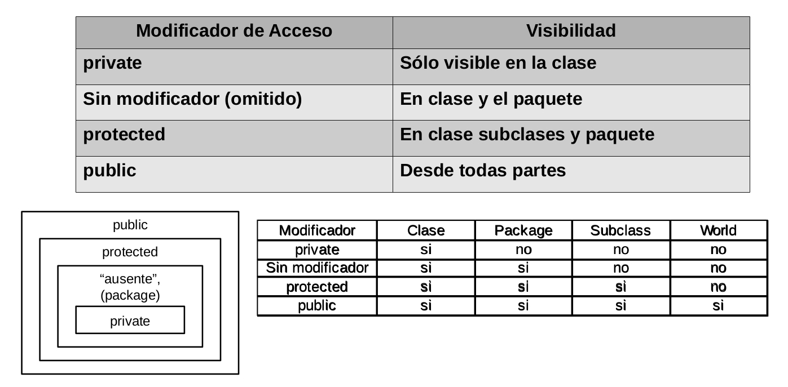

# ELO329 - Diseño y Programación Orientados a Objetos
## Clases y Objetos en Java
Agustín González
Patricio Olivares

---

# Construyendo clases nuevas

- La forma más simple de una clase en Java es:
```java
class Nombre_de_la_Clase {
    /* métodos constructores */
    /* otros métodos */
    /* atributos */
}
```
- El orden de estas partes es libre, pero se recomienda usar ese orden o aquel con atributos al comienzo.
- Ver ejemplo `Employee.java` y `EmployeeTest.java`
- Podemos definir más de una clase por archivo, pero desde otros archivos, solo tendremos acceso a la clase con nombre igual al archivo.
- Clases de nombre distinto al archivo solo son accesibles dentro del mismo archivo.

---

# Constructores en Java

- Son métodos con algunas peculiaridades:
    - Tienen igual nombre que la clase
    - Son invocados principalmente con `new`
    - Pueden ser invocados con `this` desde otro constructor de la misma clase.
    - No tienen tipo retornado ni requieren `return` explícito.
    - Java provee constructor por omisión `Clase();` es decir, sin parámetros, cuando ningún otro constructor ha sido creado.
    - Podemos proveer uno o más constructores. Esto es un tipo de sobrecarga de métodos (igual nombre con distintos parámetros).
    - El compilador busca el constructor usando su "firma": `nombre_constructor + lista de parámetros`

---

# Constructores en Java

- Inicializa objetos nuevos siguiendo el siguiente orden:
    1. Localiza memoria
    2. Asigna valores a atributos (`0`, `0.0`, `null`, …)
    3. Según el orden de aparición de los atributos de la clase se ejecutan las inicializaciones allí hechas
    4. Llama constructor de Superclase (= clase padre).
    5. Se ejecutan las sentencias del constructor.
- La primera sentencia puede ser:
    - `super(...)`: para llamar a un constructor de la clase base (o padre o superclase).
    - `this(...)`: para invocar a otro constructor de la misma clase
- Ver Ejemplo `ConstructorTest.java`

---

# Inicialización de Atributos

- Podemos proveer el valor inicial de un atributo en su declaración. Ej.
```java
int a = 20;
```
- Si esta asignación requiere más lógica (cómputo), usamos el bloque de inicialización. Ej.
```java
{ 
    // Este código es ejecutado al invocar 
    // a cualquier constructor de la clase 
    // y antes  del código asociado al constructor.
    a=20;
}
```

---

# Inicialización de Atributos

- En caso de campos estáticos, precedemos el bloque con la palabra reservada `static`.
```java
static {
    INCHES_PER_CM = 2.54;
}
```
- Este código se ejecuta antes de la primera instrucción del main.
- Ejemplo: Ver `ConstructorTest.Java`

---

# Creación de objetos nuevos

- Se invoca algún constructor de la clase.
```java
MiClase a = new MiClase();
```
- Todos los objetos son creados en el heap (memoria asignada dinámicamente durante la ejecución).
- Lo que se retorna es una referencia al nuevo objeto (puede ser pensada como un puntero o dirección donde el objeto está).
- Java tiene un proceso de recolección de basura (Garbage Collection) que automáticamente recupera la memoria de objetos no referenciados.

---

# Identificadores de Objetos v/s los objetos
```java
Cheque pejAcct; // No hay objeto aún, referencia nula/null
```

```java
pejAcct.deposit(1000000); // error, el objeto no existe aún
pejAcct = new Cheque("Peter", 1000, 40);
```

- Este ejemplo supone que la clase `Cheque` ya existe y posee miembros datos (= atributos): `name`, `balance` y `chqNum`.

---

# Asignación de objetos

```java
Cheque jmAcct;
```

```java
jmAcct = pejAcct;
```


---

# Referencias

- Los objetos son referenciados
- Esta es una forma "controlada" de usar direcciones y punteros.
- Al crear una instancia de una clase obtenemos una referencia a esa instancia.
- Mientras no asignemos un objeto a un nombre usando el operador `new` o vía una asignación, el valor del nombre será `null`.
- En caso de tipos primitivos (8), el acceso a la variable da acceso a su valor (no es referencia).
    - `byte`, `short`, `int`, `long`, `float`, `double`, `char`, `boolean`.

---

# Efectos de las referencias

- Los identificadores o nombres de objetos son referencias
    - Es decir no son el objeto mismo o su contenido.
- `=` es copiar la referencia
    - Usar método `clone` para crear copia del objeto completo (más adelante).
- `==` es comparación de referencias
    - Usar `equals` para comparar contenidos
- En `obj.aMethod(objetoPasado)`, `objetoPasado` es una referencia.
- En `obj.aMethod(tipo_básico)`, pasa el valor.
- En `return valorRetornado`, se retorna una referencia o valor según si el valor retornado es objeto o tipo básico.
    - Si queremos retornar una copia, usar `clone` para crearla y luego retornarla.

---

# Visibilidad de clases, métodos y atributos o Control de acceso a miembros de una clase

- Para crear buenas abstracciones desde fuera de una clase debemos dejar visible (accesible) solo aquello que es estrictamente necesario.
- Para esto Java posee varios **modificadores del nivel de acceso** (o visibilidad). Éstos preceden los nombres de clases, método o atributos.
- Estos modificadores son: `public`, `protected` o `private`. Si se omite, corresponde a visibilidad dentro del paquete/package.

---

# Visibilidad de clases, métodos y atributos


---

# Pregunta de aplicación

- ¿Cómo sabe el computador dónde está la JVM?
- ¿Cómo sabe el compilador `javac` y la JVM `java` dónde están las clases de una aplicación?
    - Para ubicar localización de ejecutables es necesario configurar la variable `PATH`.
    - Para clases, configurar variable `CLASSPATH`.

---

# Compilación (re-visitado)

- El compilador busca la definición de cada clase que encuentra en el archivo `<nombre_de_clase>.java`
- Para señalar al compilador dónde buscar, debemos configurar la variable de ambiente: CLASSPATH
    - El compilador y la JVM buscan los archivos en el directorio actual.
    - Si el proyecto está compuesto por varias clases en diferentes directorios, `javac` y `java` buscan las clases en los directorios indicados en la variable de ambiente `CLASSPATH`.
- Si `.class` tiene fecha más antigua que `.java`, `javac` re-compila el archivo `.java`.
- Se destaca así la importancia de los nombres de archivo de las clases que deseamos visibles desde otros archivos.