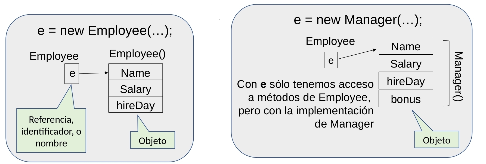
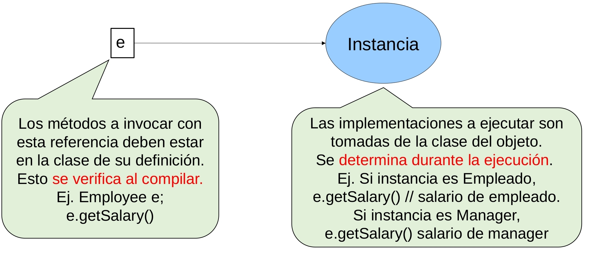

# ELO329 - Diseño y Programación Orientados a Objetos
## Herencia: Reutilización de código y código genérico
Agustín González
Patricio Olivares

---
# Introducción

- La idea básica es poder crear clases basadas en clases ya existentes.
- Cuando heredamos de una clase existente, estamos reutilizando código (métodos y atributos de la clase base).
- Agregar métodos y atributos para adaptar la clase heredada a las particularidades de la nueva categoría de objetos.
- Java también permite consultar por la estructura de una clase (cuáles son sus métodos y atributos). A esto se le llama reflexión. ¿Sabrán los animales que son animales?
- En Java se puede consultar por la naturaleza de cada objeto... Esto está fuera del alcance de este curso.

---
# Ejemplo: Estudiante es una Persona
Un(a) Estudiante es una Persona que se distingue por asistir a un lugar de estudio.


---
# Introducción (continuación)

- Identificamos herencia cuando encontramos la relación **es-un** entre una clase nueva y una ya existente. Ej.: un estudiante **es una** persona.
- La relación **es-un** es una **condición necesaria pero no suficiente**, además los objetos de la clase heredada **deben cumplir el principio de sustitución**.
- Se cumple el principio de sustitución cuando un objeto de la clase derivada puede responder de buena forma a todos los métodos públicos de la clase base.
- La clase ya existente se le llama superclase, clase base, o clase padre (son sinónimos).
- A la clase nueva se le llama subclase, clase derivada, o clase hija.

---
# Aspectos sintácticos en Java
- Si un mánager es un empleado y cumple el principio de sustitución, entonces podemos definir `Manager` extendiendo la clase `Empleado`: 

```java
class Manager extends Employee {
    // aquí ponemos lo específico de un mánager
    // que no es común a todo empleado.
}
```
Ver ejemplo: `ManagerTest.java`
- Forma gráfica de representar la relación de herencia


---
# Redefinición de métodos
- En la clase derivada podemos **redefinir** ("override" o sobremontar) métodos, lo cual corresponde a re-implementar o recodificar en la subclase un método de la clase base.
- Si en la clase hija deseamos acceder al método de la clase base, lo podemos hacer utilizando la palabra **super** como referencia al padre.
- Recordar que también usamos esta palabra reservada para invocar constructores de la clase base.

---
# Ejemplo: Un mánager también es un empleado
- Supongamos que un mánager recibe bonos por su desempeño. Luego, su salario será aquel en su calidad de empleado más sus bonos.
- Ver `ManagerTest.java`
- Ej.: jerarquía de clases:


---
# Principio de sustitución re-visitado
## (Propiedad de subtipo)
- Según el principio de sustitución, referencias a objetos de la clase base, pueden apuntar a objetos de una clase derivada sin crear problemas.
- Hay que tener cuidado con la relación es-un. El español permite decir que un cuadrado es un rectángulo de lados iguales; sin embargo, esto lleva a problemas cuando queremos aplicar el principio de sustitución.


---
# Ejemplo: ¿Los cuadrados son rectángulos?
- ¿Qué pasa si recibidos una referencia a rectángulo y se nos ocurre invocar un cambio en uno de los lados?
- Lo podemos arreglar con redefinición de métodos, pero ¿qué pasa con el uso natural que daríamos a rectángulos?
- ¿Qué hay de la memoria ocupada si una aplicación requiere muchos cuadrados?
- Por ejemplo ver una posible implementación aquí: `Rectangle.java`

---
# Polimorfismo 
## (RAE: Cualidad de lo que tiene o puede tener distintas formas)
- Hay varias formas de polimorfismo:
    - Cuando vía subtipo asignamos una instancia de una subclase a una referencia de la clase base. Ej. Un **Estudiante adopta el rol de Persona**.
    - Cuando invocamos el mismo nombre de método sobre instancias de distintas clases.
    - Cuando definimos múltiples métodos con igual nombre (los argumentos deben cambiar).
---
# Polimorfismo 
## (RAE: Cualidad de lo que tiene o puede tener distintas formas)
- La primera forma de polimorfismo listada corresponde a Subtipo o principio de sustitución.
- ¿Cómo podemos asignar un objeto que tiene más atributos a uno que tiene menos? No hay problema cuando ambos son referencias ("punteros").

---
# Polimorfismo: Ejemplo

```java
class Employee { ..... }
class Manager extends Employee { .... }
Employee e; // referencia o nombre
e = new Employee(...); // instancia
```
Usando `e` tenemos acceso a todo lo  correspondiente a un `Employee`.

---
# Polimorfismo: Ejemplo


```java
Employee e;
e = new Manager(..); // Es OK por Principio de Sustitución
```
Usando `e` tenemos acceso a todo lo correspondiente a `Employee`, pero con la implementación de `Manager`.
- Al revés (asignar un `Employee` a una referencia de `Manager`) no es válido toda referencia a Manager debe poder responder a todos sus métodos.
 ```java
Manager m = new Employee(). // ERROR!
```

---
# Polimorfismo: Ejemplo
Sea
```java
class Employee { ..... }
class Manager extends Employee { .... }
Employee e;
```


---
# Ligado Dinámico 
## Muy importante

- Es importante entender qué método es ejecutado al manipular un nombre que se puede referir a instancias de clases derivadas.
- Al momento de la compilación el compilador intenta resolver el método que corresponda según su nombre y parámetros. Si la superclase y la clase base tienen definido el mismo método ¿Qué implementación se invoca?.
- **Se invocará el método definido en la clase del objeto y no el método de la clase de la referencia. A esto se le llama ligado dinámico.**
- Por ello, si una clase derivada redefine el mismo método, éste será invocado para sus instancias.
- **¿Cuándo no se usa ligado dinámico? Cuando el método en la clase de la referencia es privado, static, o final.**

---
# Ligado Dinámico (ilustrado)
