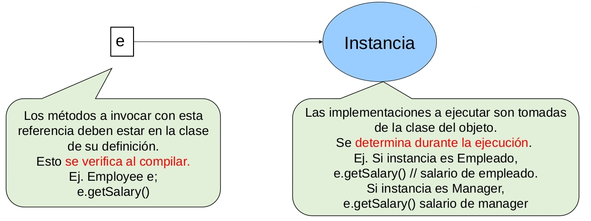

# ELO329 - Diseño y Programación Orientados a Objetos
## Ligado Dinámico y Clases Abstractas (*): Reutilización de código y código genérico
Agustín González
Patricio Olivares

---
# Recordemos un segmento de código de `ManagerTest.java`

```java 
class Manager extends Employee{
    ...
}
```
```java
public static void main(String[] args) {
    // construct a Manager object
    Manager boss = new Manager("Carl Cracker" 80000,1987,12,15);
    boss.setBonus(5000);
    Employee[] staff = new Employee[3];
    // fill the staff array with Manager and Employee objects
    staff[0] = boss;
    staff[1] = new Employee("Harry Hacker", 50000,1989, 10, 1);
    staff[2] = new Employee("Tommy Tester", 40000,1990, 3, 15);
    // print out information about all Employee objects
    for (int i = 0; i < staff.length; i++) {
        Employee e = staff[i];
        System.out.println("name=" + e.getName() + ",salary=" + e.getSalary());
    }
}
```

---
# Ligado Dinámico aplicado
- Cuando existe relación de herencia entre dos clases, una referencia a la clase base (`staff[0]`) puede apuntar a una instancia de la clase
derivada (`boss`).
- Si la superclase `Employee` y la clase hija `Manager` tienen implementado el mismo método `getSalary()` ¿Qué implementación se invoca?
- **Se ejecuta la implementación de `Manager`. Notar que `getSalary()` es un método publico.**
- Si en Employee este método fuera `private`, `static`, o `final` se ejecuta la implementación de `Employee`.

---
# Ligado Dinámico (ilustrado)
```java
Employee e = new Manager(….); // es OK
Employee e = new Employee(...); // es OK
```


---
# Compilación v/s Ejecución
- El **compilador** verifica que los accesos y métodos invocados sean válidos en la **clase declarada para el identificador** o nombre del objeto.
- En tiempo de ejecución, el código ejecutado depende de la declaración del método invocado. Si corresponde ligado dinámico, el **código ejecutado será el del objeto apuntado por la referencia**.
- Debemos distinguir entre la clase de la referencia y la clase del objeto apuntado por la referencia.

---
# Ligado Dinámico (cont.)
- Gracias al **ligado dinámico** es posible hacer **programas fácilmente extensibles**.
- Creamos una clase derivada y redefinimos los comportamientos que deseamos.
- No se requiere recompilar las clases existentes. Esto es usado intensamente al utilizar clases predefinidas en el lenguaje.
- Si deseamos impedir que una de nuestras clases se use como base, la declaramos como `final`. Estas no se pueden derivar. Ej.
```java
final class Manager extends Employee { ... }
```
- Si un método es final, ninguna subclase puede redefinirlo.
- El ligado dinámico es más lento que el estático (> tiempo de
ejecución).

---
# Valores retornados por métodos redefinidos
- Para redefinir un método, su nombre y sus parámetros se deben conservar; sin embargo, **el valor retornado podría variar**.
- Se debe cumplir que el objeto retornado por la clase derivada sea subtipo del retornado en la clase base.
- Ej.
```java
Employee getColleague() {…} // en clase base
Manager getColleague() {…} // en clase hija (Redefinición válida)
```


---
# "Casteo": Cambio de tipo forzado

```java
ClasePadre p = new ClaseHija(..);
```
- ¿Podemos acceder a un método definido sólo en una clase derivada con una referencia de la clase base? **R: No directamente**.
- El objeto debe ser referenciado por un nombre de la clase hija luego de haber hecho un cambio de tipo forzado.

---
# "Casteo": Cambio de tipo forzado

Ej.

```java
Employee e= new Manager(..);
```
- Con `e` **no podemos** acceder a los métodos presentes sólo en `Manager`.
- Para hacerlo, usamos:
```java
Manager m = (Manager) e;
```
- **Ahora con `m` sí podemos invocar los métodos sólo presentes en `Manager`**.

---
# “Casteo”: Cambio de tipo forzado (cont.)
- ¿Cómo sabemos que `e` es una referencia a una instancia de `Manger`?
- Lo podemos preguntar con el operador `instanceof`.
```java
if (e instanceof Manager) {
    m = (Manager) e;
    .....
}
```
- Así nos aseguramos que `e` es referencia a un `Manager`. Si `e` no fuera `Manager` y asignamos:
```java
m = (Manager) e;
```
el compilador aceptará las invocaciones a `setBonus()`, pero en tiempo de ejecución tendremos un error.

---
# Clases abstractas
- Llevando la idea de herencia a un extremo, podemos pensar en buenas clases para representar a un grupo de objetos, pero que **algún método no puede ser implementado** por depender de cada subclase.
    - Por ejemplo: Clase `Forma` como clase base de `Triangulo`, `Circulo`, `Cuadrado`;
    - Cómo implementamos `getArea()` en `Forma`? No se puede.
    - `Forma` puede indicar todo el comportamiento válido; por ejemplo método `getArea()`, pero no tenemos cómo implementarlo sin saber de qué forma se trata.
    - No tiene sentido y es error de compilación instanciar una clase que no tiene todos los métodos implementados (ej. `getArea()`).
Es decir no podemos hacer `new Forma()`, cuando `Forma` es abstracta.

---
# Clases abstractas (cont.)
- En el caso de `Forma`, debe declararse como **clase abstracta** por tener al menos un método declarado pero no implementado.

```java
public abstract class Forma {
    ...
    public abstract double getArea();
    ..
}
```
- Ver `PersonTest.java`. Revisar uso de clases abstractas.
- Ver `CatsAndDogs.java`. Revisar uso de clases abstractas y colecciones, en particular `ArrayList<"clase">`