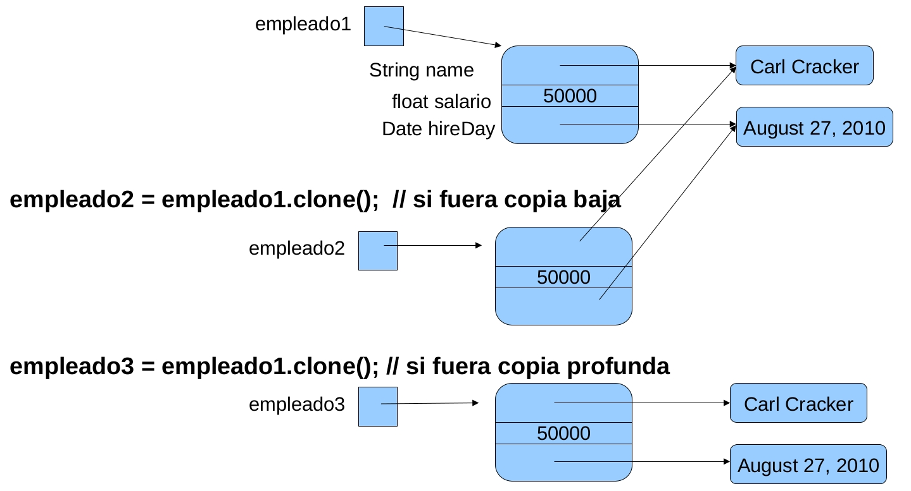

# ELO329 - Diseño y Programación Orientados a Objetos

## Clases Anidadas

Agustín González
Patricio Olivares

---
# Clases Anidadas
- Las **clases anidadas** son clases definidas al interior de otra clase o dentro de un método.
- Tres razones para ofrecer esto en Java:
    - Aumenta la encapsulación al agrupar clases usadas solo en una clase.
    - Generan código más legible y mantenible.
    - Permiten reducir código fuente.
- Cuando usamos instancias de una clase `B` solo al interior de una clase `A`, podemos definir `B` al interior de `A`.
- Puede haber clases anidadas estáticas y no estáticas. A estas últimas se les llama también **clases internas**.
- Ejemplo: [`java.awt.geom.Rectangle2D`](https://docs.oracle.com/en/java/javase/21/docs/api/java.desktop/java/awt/geom/Rectangle2D.html), la cual define dos clases
anidadas: `Rectangle2D.Double` y `Rectangle2D.float`.

---
# Clases Anidadas: hay de dos tipos


Ejemplo
```java
class OuterClass { // Clase anfitriona
    ...
    static class StaticNestedClass { // estática
        ...
    }
    class InnerClass { // no estática o interna
        ...
    }
}
```
---
# Clases anidadas estáticas e internas
- Las **clases internas están asociadas a instancias (objetos)** de clase anfitriona.
- Las clases internas tienen acceso a los atributos de la anfitriona (incluso si son privados) no así las clases anidadas estáticas.
- Las **clases anidadas estáticas están asociadas a la clase** anfitriona.
- Como miembros de la clase anfitriona, las clases anidadas pueden ser declaradas `private`, `public`, `protected` o del paquete (cuando omitimos el calificador).
- Son útiles para reducir código fuente. Especialmente cuando la clase solo genera instancias locales.
- Son comunes en el desarrollo de interfaces gráficas.

---
# Creación de instancias de Clases Anidadas

Ejemplo creación de una instancia (en clases public):
- **Clases estáticas anidadas:**
```java
OuterClass.StaticNestedClass nestedObject = new OuterClass.StaticNestedClass();
```
- **Clases internas (no estática):**
```java
//OJO primero debemos crear un objeto
OuterClass outerObject = new OuterClass();
OuterClass.InnerClass innerObject = outerObject.new InnerClass();
```
---
# Creación de instancias de Clases Anidadas
- Las clases anidadas existen solo para el compilador, ya que éste las transforma en clases regulares separando la clase externa y anidada con signo `$`.
- También se pueden definir al interior de un método.
---
# Ej. de Clase Interna `InnerClasstest.java`

```java
class BankAccount {
    public BankAccount(double initialBalance) {
        balance = initialBalance;
    }
    public void start(double rate){
        ActionListener adder = new InterestAdder(rate);
        Timer t = new Timer(1000, adder);
        t.start(); // invoca a método de Timer
    }
    private double balance;

    private class InterestAdder implements ActionListener {
        public InterestAdder(double aRate) {
            rate = aRate;
        }
        public void actionPerformed(ActionEvent event) {
            double interest = balance * rate / 100;
            balance += interest;
            // notar que tiene acceso a balance
            NumberFormat formatter = NumberFormat.getCurrencyInstance();
            System.out.println("balance=" + formatter.format(balance));
        }
        private double rate;
    }
}
```
---
# # Ej. de Clase Interna `InnerClasstest.java`
- Instancias de la clase Timer un vez iniciados invocan al método `actionPerformed` regularmente.
- Solo ocupamos una instancia de la clase interna en método `start`.

---
# Clase interna dentro de un método

```java
// InnerClassMethodTest.java
class BankAccount {
    public BankAccount(double initialBalance) {
        balance = initialBalance;
    }
    public void start(double rate) {
    class InterestAdder implements ActionListener {
        public InterestAdder(double aRate) {
            rate = aRate;
        }
        public void actionPerformed(ActionEvent event) {
            double interest = balance * rate / 100;
            balance += interest;
            NumberFormat formatter = NumberFormat.getCurrencyInstance();
            System.out.println("balance=" + formatter.format(balance));
        }
        private double rate;
    }
    ActionListener adder = new InterestAdder(rate);
        Timer t = new Timer(1000, adder);
        t.start();
    } // fin del método start
    private double balance;
}
```
---
# Clases internas anónimas

- Si deseáramos proveer de una implementación a los métodos de una interfaz para crear un único objeto ¿para qué definir una clase?
- Cuando necesitamos solo una instancia de una clase que implementa una interfaz, no necesitamos darle un nombre.
- Decimos que tal clase es **interna y anónima**.

---
# Ejemplo: Clase Anónima

```java
class BankAccount {
    public BankAccount(double initialBalance) {
        balance = initialBalance;
    }
    public void start(final double rate) {
        // adder es única instancia
        ActionListener adder = new ActionListener() { // Implementación
            public void actionPerformed(ActionEvent event) {
                double interest = balance * rate / 100;
                balance += interest;
                NumberFormat formatter = NumberFormat.getCurrencyInstance();
                System.out.println("balance=" + formatter.format(balance));
            }
        };

        Timer t = new Timer(1000, adder);
        t.start();
    }
    private double balance;
}
```
---
# Copia baja, copia profunda y clone
---
# Método `clone()` en `Object` (revisitado)
- El método `clone()` existe con acceso protegido en la clase `Object`.
- Para invocarlo sobre un objeto, se requiere implementar la interfaz `Clonable` en clase del objeto, lo cual significa que debemos redefinir el método `clone`.
- Para generar un clone, debemos hacerlo invocando el método `clone` de la clase `Object`.
- El método `clone` de `Object` crea y retorna un objeto con igual estructura al objeto llamado e inicializa todos sus campos con el mismo contenido de los campos del objeto llamado.
- Los contenidos de cada campo no son clonados. Hasta aquí se le llama **copia baja**. Para una **copia profunda** (o completa) se debe llamar el método clone de cada atributo.

---
# Copia baja v/s copia profunda


--- 
# Implementación de clone (copia profunda)
La implementación típica es como sigue:
```java
class Employee implements Cloneable {
    public Object clone() { // redefinición de clone
        try { // el manejo de excepciones se verá más adelante
            Employee c=(Employee)super.clone();// no usamos constructor,
            // Hasta aquí copia baja
            c.hireDay = hireDay.clone(); //Necesario copia profunda
            return c;
        }catch (CloneNotSupportedException e ) {
            return null;
        }
    }
    ....
    private String name;
    private float salary;
    private Date hireDay;
}
```
---
# Implementación de clone (copia profunda)
- String es clase no mutante (no tiene métodos que cambien su estado), no requerimos clonarlo
- Ver `CloneTest.java`