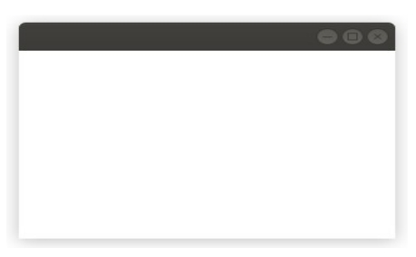
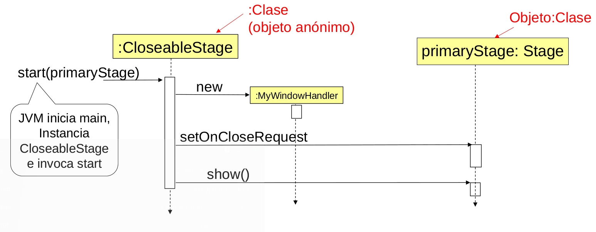
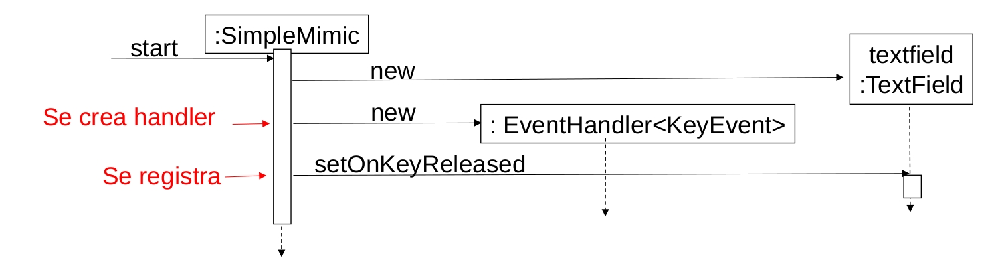
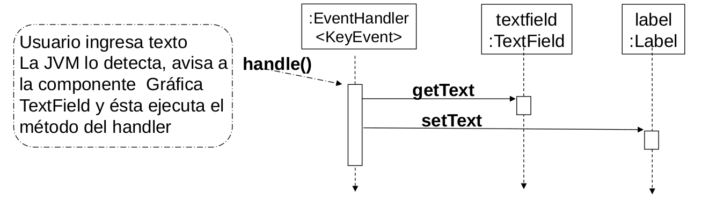
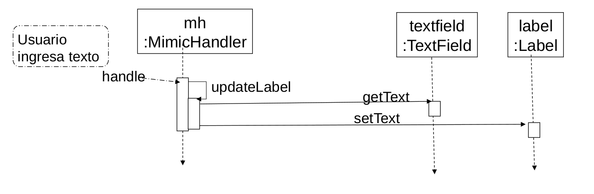

# ELO329 - Diseño y Programación Orientados a Objetos

## Programación basada en/dirigida por eventos 
## "Event-Based Programming" (o Event-driven Programming): Conceptos

Agustín González
Patricio Olivares

---
# Introducción
- Hasta ahora nuestros programas ejecutan instrucciones siguiendo el orden de llamados definido en método main (*).
- Ésta no es la forma como parecen operar los programas con interfaces gráficas. En éstos el programa debe responder cada vez a una solicitud del usuario en alguna de las partes de la interfaz gráfica
- ¿Cómo monitorear dónde el usuario hará el siguiente click? Para esto ayuda la programación "conducida por eventos" o "basada en eventos".

(*) Una excepción a esto fue la clase `Timer` cuando estudiamos clases anidadas.

---
# Programación basada en eventos: Otro paradigma de programación
- La programación basada en eventos (o programación dirigida por eventos) es aquella donde el flujo del programa está determinado por eventos; por ejemplo, salidas de un sensor, eventos de usuario (mouse, teclado), mensajes desde otros programas (locales o remotos), etc.
- También puede ser definida como una técnica para estructurar aplicaciones en donde la aplicación tiene un loop principal con las siguientes dos secciones:
    - Selección o detección de evento
    - Manejo o reacción frente al evento
---
# Programación basada en eventos: Otro paradigma de programación
- Ejemplo:
```shell
Inicialización;
Forever do {
    Detecte la llegada de un evento;
    Ejecute acción definida para ese evento;
}
```
---
# Otro paradigma de programación (cont.)
- En sistemas embebidos (micro-procesadores / microcontroladores, etc) y para responder a eventos de hardware, este modelo se implementa usando interrupciones en lugar de correr un loop infinito.
- Programas basados en eventos pueden ser escritos en cualquier lenguaje pero esta tarea se facilita en los lenguajes que proveen abstracciones de alto nivel para ello.
- En **Java el loop infinito lo proporciona el ambiente gráfico de Java**. El programador solo debe registrar el código a ejecutar ante la ocurrencia de cada evento de interés.
---
# Uso de programación de eventos en GUIs

- Este modelo tiene gran aplicación en la programación de interfaces gráficas de usuarios.
- Hasta ahora, los programas de consolas típicos siguen un flujo secuencial en que típicamente se tienen ciclos:
    - Entrada → procesamiento → salida
- Cuando programamos una Interfaz Gráfica de Usuario (**GUI**: Graphics User Interface) debemos tomar en cuenta la variedad de posibles interacciones con el usuario.
---
# Uso de programación de eventos en GUIs
- En lugar de un único flujo de entrada de datos por consola, las GUIs permiten muchas más acciones del usuario.
    - Por ejemplo: es posible presionar botones gráficos, escribir texto en un campo de texto, o mover algún "scrollbar".
    - ¿Cómo podemos estar atentos a tantas cosas al mismo tiempo?
---
# Modelo
- Una forma de manejar todo tipo de posibles interacciones de usuarios es el **uso de interrupciones**; por ejemplo, cuando suena el timbre o teléfono en casa.
- De esta manera la CPU no pierde tiempo "mirando" los posibles eventos de usuarios, sino simplemente responde al evento y reanuda su procesamiento normal (otras tareas).
- Lenguajes como Java nos permiten **definir y manejar interrupciones o eventos por software**.
---
# Modelo
- La API de Java permite crear clases, llamadas **listeners o handler**, cuyos objetos responden a eventos causados por la GUI.
- La API de Java tiene **interfaces (listeners o handlers)** que deben ser implementadas por la clase que atenderá (manejará) los eventos de interés.
- Los métodos de la interfaz ("equivalen a las rutinas de servicio de interrupción") son llamados cuando un evento específico ocurre.
---
# Pasos para programar respuestas a Eventos

- Un **handler** es una instancia de una clase definida por el usuario. Esta clase implementa los métodos de una Interfaz (estos métodos equivalen a las rutinas para atender los eventos de interés).
- Las componentes gráficas de Java definen el métodos asociados a eventos y los datos pasados al invocarlo.
---
# Ejemplo
- Veamos el caso de una ventana de nivel superior en Java (son aquellas que se pueden mover libremente en la pantalla - desktop) `CloseableStage.java`.
```java
public class CloseableStage extends Application {
    public void start(Stage primaryStage) {
        // Creamos elementos de la ventana
        BorderPane root = new BorderPane();
        Scene scene = new Scene(root,300,200);
        primaryStage.setScene(scene);

        // Creamos Listener asociado al cierre de ventana
        primaryStage.setOnCloseRequest(new MyWindowHandler());
        primaryStage.show();
    }
    public static void main(String[] args) {
        launch(args); // de este método de Application se llama a start.
    }
}
```
---
# Ejemplo (continuación)
```java
class MyWindowHandler implements EventHandler<WindowEvent>{
    public void handle(WindowEvent e) {
        System.out.println("Stage is closing");
    }
}
```
- Como resultado de la ejecución obtenemos:

- **OJO**: otra opción habría sido declarar `MyWindowListener` como clase anónima o como expresión Lambda!
---
# ¿Cómo se compila esto?
- Este ejemplo usa componentes gráficas de JavaFX.
- Se debe bajar e instalar JavaFX (https://gluonhq.com/products/javafx/).
- Identificar la ubicación donde usted deja su JavaFX-sdk, sea este `<path/to/javafx-sdk/lib>`
---
# ¿Cómo se compila?
```shell
$ javac --module-path <path/to/javafx-sdk/lib> --add-modules javafx.controls
```
- En mi caso
```shell
$javac --module-path ~/tools/javafx-sdk-21.0.2/lib --add-modules javafx.controls CloseableStage.java
```
- Luego
```shell
$java --module-path ~/tools/javafx-sdk-21.0.2/lib --add-modules javafx.controls CloseableStage
```
---
# Relación estática de clases (generada con Jprasp)
- Misma aplicación usando Expresiones Lambda (`CloseableStage_Lambda.java`)
```java
public class CloseableStage_Lambda extends Application {
    public void start(Stage primaryStage) {
        // Creamos elementos de la ventana
        BorderPane root = new BorderPane();
        Scene scene = new Scene(root,300,200);
        primaryStage.setScene(scene);
        // Creamos Listener asociado al cierre de ventana
        primaryStage.setOnCloseRequest(e->System.out.println("Stage is closing"));
        primaryStage.show();
    }
    public static void main(String[] args) {
        launch(args);
    }
}
```
---
# Diagrama de secuencia UML para creación de ventana
- Muestra la dinámica al crear una ventana.

---
# Explicación
- La clase `CloseableStage`, que extiende la clase `Application`, es la encargada de ejecutar el programa gráfico.
- Un objeto de la clase `Stage` corresponde a una ventana gráfica en el programa. La aplicación puede crear tantas ventanas como lo desee creando múltiples objetos `Stage`.
---
# Explicación
- Una instancia de `MyWindowHandler` es registrada con el método `setOnCloseRequest` de la `Stage` (es como configurar quién atenderá los eventos de cierre la ventana). Cuando el evento ocurre, la máquina virtual Java lo detecta y verifica si hay handlers esperando por ese evento. Si los hay, en este caso automáticamente llama al método handle de la interfaz `EventHandler`.
- En este ejemplo, la interfaz `EventHandler` es implementada por la clase `MyWindowHandler`, así su instancia puede responder a los eventos de la stage.
- La mayoría de las otras interfaces para eventos no difieren mucho. Veremos otro ejemplo.
---
# Entrada en Campo de texto
- Supongamos que queremos leer lo ingresado en un campo de texto y luego copiarlo en un texto de la ventana (label).
- Ver `SimpleMimic.java`
---
# Diagrama de secuencia
- **Situación**: Creación de `handler` (manejador del evento) y su registro en la componente gráfica (`TextField`).

- Se espera que este tipo de diagramas puedan ser hechos antes de escribir el código (alguien experimentado).
- Estos diagramas son una buena documentación del código.
---
# Diagrama de secuencia
- **Situación** (caso de uso): Usuario ingresa nuevo texto y presiona "Enter". Esto gatilla el evento esperado.

- Es recomendable tener bien clara esta interacción de objetos. Este diagrama sirve además como documentación.
- TextField y Label pertenecen a la biblioteca JavaFX. Luego, solo hay que escribir el código para las otras tres clases.
---
# Entrada en Campo de texto: versión 2
- Esta versión separa roles -`Panel` y `EventHandler`-, para este problema simple probablemente no se justifica.
- La idea es explorar otras situaciones posibles.
- Ver `Mimic.java`.
- Usted puede ver también `Mimic_Lambda.java`.
---
# Diagrama de secuencia
- Caso de uso: Ingreso de nuevo texto. Esto gatilla el evento esperado.

---
# Explicación del ejemplo
- El handler mh es registrado con el objeto textfield de la clase `TextField` en el método `start` de `Mimic` al ejecutar `textfield.setOnKeyReleased(mh)`.
- Cuando un handler es registrado, éste es agregado a una lista interna que mantiene los objetos que deben ser notificados cuando ocurre un evento. Podemos tener más de un handler registrado por evento.
- Cuando ocurre el evento `KeyReleased`, el método `handle(KeyEvent)` de la clase `MimicListener` es llamado por el objeto `TextField`, el cual se entera del evento por la JVM. Notar que los datos sobre el evento son pasado al método vía el parámetro.
- El código en el método `handle` del handler maneja el evento actualizando el campo de texto en el objeto `Label`.
---
# Algunas recomendaciones
- No es estrictamente necesario poner la descripción de las componentes de la GUI en una clase separada, pero es buena idea. Incluso puede ser conveniente poner cada clase en un archivo separado para así distinguir la presentación e interacción con el usuario del procesamiento o cálculo interno.
- Si en método `handle` no verificamos qué tecla se ingresó, `updateLabel()`, será llamada con cada letra presionada.