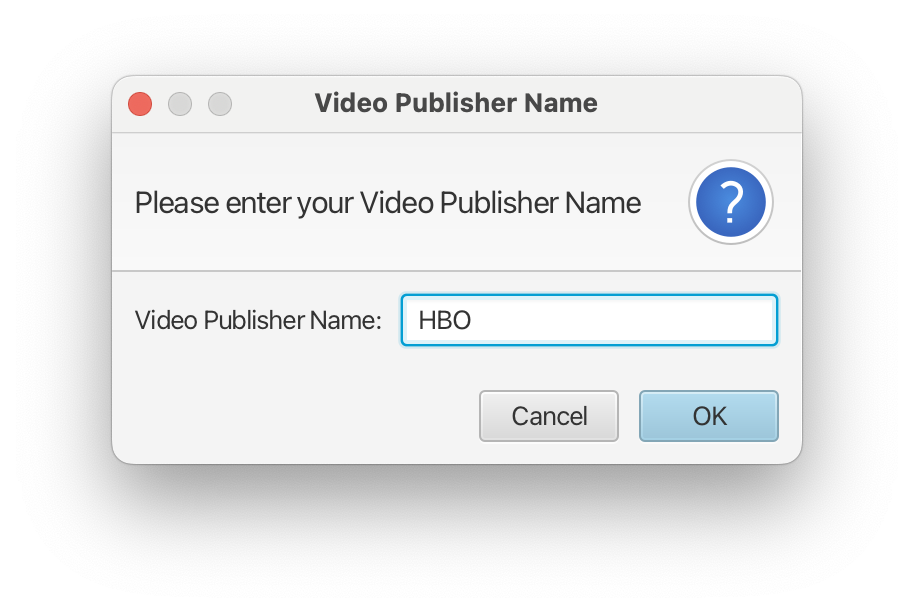
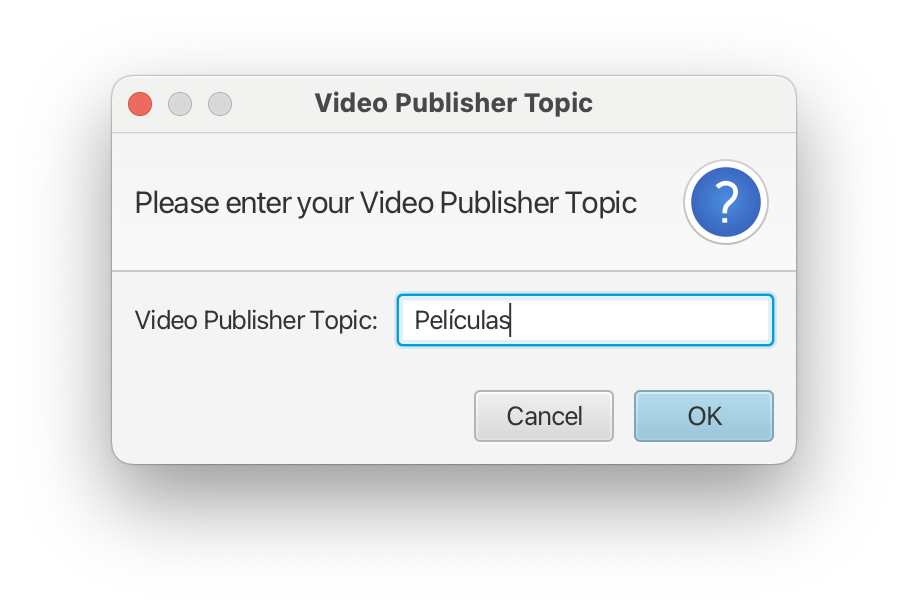
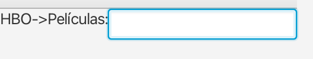
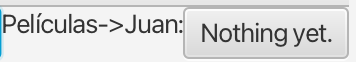
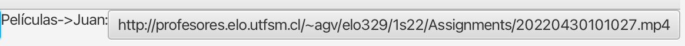
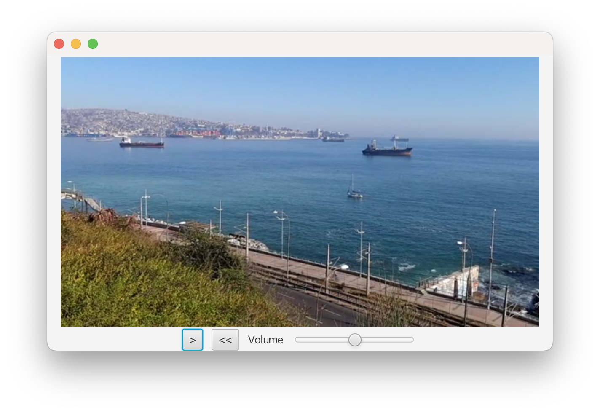
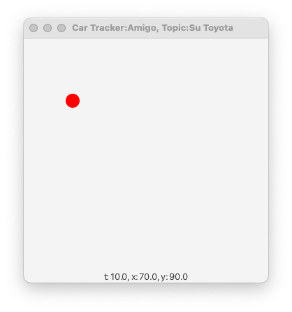
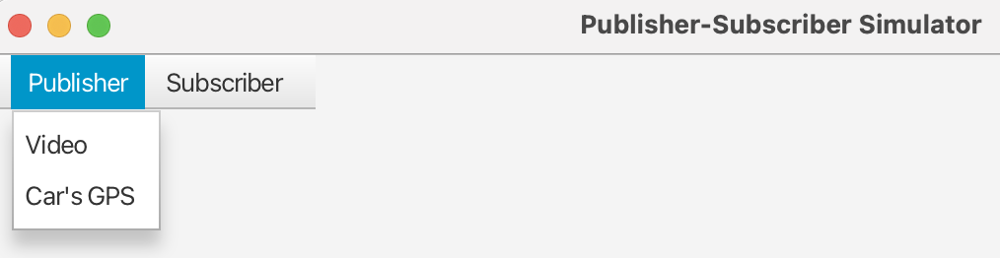
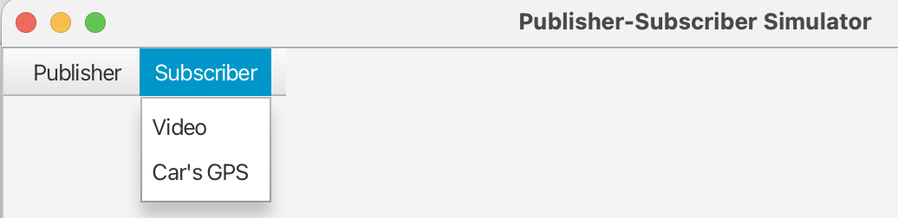
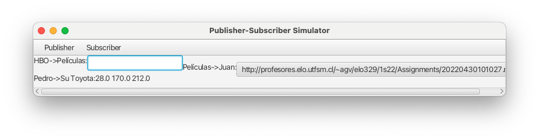

<script type="text/javascript" src="http://cdn.mathjax.org/mathjax/latest/MathJax.js?config=TeX-AMS-MML_HTMLorMML"></script>
<script type="text/x-mathjax-config">
  MathJax.Hub.Config({ tex2jax: {inlineMath: [['$', '$']]}, messageStyle: "none" });
</script>

# Diseño y Programación Orientados a Objetos
### 1er. Semestre 2025

## Tarea 2: Simulador Gráfico del Patrón de Diseño Publicador Suscriptor

Lea detenidamente la tarea. **Si algo no lo entiende, consulte al profesor**. Esta interacción se asemeja a la interacción entre desarrolladores y clientes cuando algún requerimiento no está del todo especificado.

### 1. Objetivos de la tarea

- Modelar objetos reales como objetos de software.
- Ejercitar la creación y extensión de clases dadas para satisfacer nuevos requerimientos.
- Reconocer clases y relaciones entre ellas en códigos fuentes Java.
- Ejercitar la configuración de un ambiente de trabajo para desarrollar aplicaciones JavaFX. Se pide trabajar con un IDE (Integrated Development Environment). Si bien IntelliJ es el sugerido, su grupo puede trabajar con otro IDE.
- Manejar proyectos de software vía Git (**obligatorio** en esta tarea)
- Ejercitar la preparación y entrega de resultados de software (`readme`, documentación).
- Familiarización con desarrollos "iterativos" e "incrementales".

### 2. Descripción General

Esta tarea busca adaptar y extender la tarea 1 para simular gráficamente, usando JavaFX, el patrón de diseño publicador y suscriptor.  
Este simulador permite crear, a través de un menú, 2 tipos de publicadores de URLs representando la ubicación en Internet de un video y de posiciones de un móvil. Los dos tipos de publicadores solicitan ingresar un nombre del publicador y un tópico. El ingreso de ambos campos se hace a través de una ventana de diálogo para ingresar un texto. Ver Figura 1.

<p float="center">
  
  
</p>

**Figura 1:** Componentes lógicos del patrón publicador y suscriptor

<div class="page"/>

#### 2.1 Publicador y suscriptor de videos

Este tipo de publicador presenta un campo de texto donde se ingresa el URL del video, ver Figura 2. Los suscriptores al tópico de este publicador muestran un botón cuyo texto corresponde al último  
URL publicado. Al presionar el botón, el suscriptor puede ver el video publicado, ver Figuras 3 y 4.

<div style="display: flex; justify-content: center;">
  <figure style="text-align: center;">
    
    <figcaption>(a)</figcaption>
  </figure>
  <figure style="text-align: center;">
    
    <figcaption>(b)</figcaption>
  </figure>
</div>

**Figura 2**: Ejemplo de vista de un publicador (a) y un suscriptor (b) de videos  



**Figura 3**: Ejemplo de botón que ya recibió una publicación



**Figura 4**: Ejemplo de reproductor del video al presionar el botón

#### 2.2 Publicador y suscriptor de la posición de un móvil

Al crear este tipo de publicador, luego de especificar el nombre y el tópico, usando la clase `FileChooser`, el programa pide seleccionar el archivo que contiene las posiciones relevantes a simular por el GPS del móvil. El archivo de posiciones tiene el siguiente formato por cada línea de texto:

```
<tiempo> <posición x> <posición y>
```

El tiempo es un **número entero en segundos**, aún cuando pueda ingresarse y leerse como número real.  
El GPS del móvil lee este archivo e interpola las posiciones intermedias para enviar una posición cada segundo. El mensaje enviado contiene la información de cada línea del archivo, ver Figura 5.


**Figura 5**: Ejemplo de vista para el publicador de posiciones, envía los datos de la derecha

Los suscriptores de posición muestran un círculo de color, cuya posición se actualiza cada vez que una nueva posición es publicada. Cada suscriptor crea una ventana propia para mostrar el avance del móvil de su tópico. En la parte inferior de la ventana muestra el tiempo y las coordenadas $x$ e $y$ del móvil seguido, ver Figura 6.



**Figura 6**: Ejemplo de vista para el seguidor de posición del móvil

### 3. Interfaz Gráfica

La interfaz gráfica de este simulador muestra una barra de menú con opciones para crear instancias de publicadores de cualquiera de los dos tipos, ver Figura 7a. Otra opción permite crear instancias de suscriptores para cada tipo de publicador, ver Figura 7b. El lado izquierdo muestra los publicadores y el derecho muestra los suscriptores de video, Figura 8. Los suscriptores de posición solo muestran en ventanas propias independientes, Figura 6.

<div style="display: flex; justify-content: center;">
  <figure style="text-align: center;">
    
    <figcaption>(a)</figcaption>
  </figure>
  <figure style="text-align: center;">
    
    <figcaption>(b)</figcaption>
  </figure>
</div>

**Figura 7**: Ejemplos de opciones para publicador (a) y para subscriptor (b)  




**Figura 8**: Ejemplo de vista de publicadores (izquierda) y suscriptores (derecha)

### 4. Funcionamiento de la Aplicación

En esta oportunidad se espera que su programa se ejecute desde un IDE (`IntelliJ` de preferencia o   alternativamente `Visual Studio Code`).  
Una gran diferencia con la Tarea 1 la genera el nuevo paradigma usado en Tarea 2: "programación conducida por eventos". En la Tarea 1, el método `main` activaba todos los cambios del programa. En esta tarea los eventos del usuario y los del programa gobernarán la ejecución del programa.

### 5. Desarrollo en Etapas

Para llegar al resultado final de esta tarea usted debe aplicar una metodología de desarrollo "[Iterativo  
y creciente (o incremental)](https://es.wikipedia.org/wiki/Desarrollo_iterativo_y_creciente)" para desarrollar software. Usted y su equipo irán desarrollando etapas donde los requerimientos del sistema final son abordados gradualmente. En cada etapa usted y su equipo obtendrá una solución que funciona para un subconjunto de los requerimientos finales o bien es un avance hacia ellos. Esto tiene por objetivo familiarizarse con la metodología de desarrollo iterativo e incremental.

#### 5.1 Primera Etapa: Publicador y suscriptor de videos

En esta primera etapa se espera que usted reutilice las clases `Topic`, `Broker`, `Component`, `Publisher` y `Subscriber` de la Tarea1. Adicionalmente cree las clases `VideoPublisher` y `VideoFollower`, las cuales extienden las clases `Publisher` y `Subscriber` respectivamente. `VideoPublisher` incluye una vista como la Figura 2a. Al presionar `ENTER` en campo de texto, el URL es publicado y el campo de texto es borrado. `VideoFollower` muestra una vista como la Figura 2b. El texto del botón se actualiza ante una nueva publicación de URL. En esta etapa el botón no responde al ser presionado. El programa `Stage1.java` crea la interfaz gráfica de la aplicación la cual contendrá un menú con submenús "Publisher" y "Subscriber". En esta etapa, ambos submenús tendrán sólo la opción Video. Al seleccionar opción de Video de Publisher, el programa creará una `TextInputDialog` para solicitar el nombre del publicador y luego el nombre del tópico, ver Figura 1. 
Entregue las clases de esta etapa.

Si lo desea, usted puede usar y/o completar el [código inicial](http://profesores.elo.utfsm.cl/~agv/elo329/1s25/Assignments/T2/Stage1.tar) para esta etapa. [Aquí](http://profesores.elo.utfsm.cl/~agv/elo329/1s25/Assignments/T2/ELO329.T2.Stage1.ClassDiagram.BaseCode.png) está el diagrama de clases para este diseño. Usted no está obligado(a) a usar estos códigos. Están para su conveniencia y en caso de que le resulten útiles. Otras formas de estructurar el resultado hasta llegar a la etapa 4 también son válidas.

#### 5.2 Segunda Etapa: Se agrega reproductor de video a etapa previa

Complete el `VideoFollower` para reaccionar a su botón. Al presionarlo se inicia la reproducción del video como se muestra en la Figura 4.  
Para probar, usted puede usar los siguientes videos:

http://profesores.elo.utfsm.cl/~agv/elo329/1s22/Assignments/20220430_100849.mp4
http://profesores.elo.utfsm.cl/~agv/elo329/1s22/Assignments/20220430_101027.mp4

#### 5.3 Tercera Etapa: Publicador de GPS de posiciones de un móvil

Cree las clases `GPSCarPublisher` la cual extiende `Publisher`. Al seleccionar la opción Car's GPS de Publisher del menú, al igual que en las etapas previas, el programa pide el nombre y tópico del publicador, Figura 1. Para este publicador, use una instancia de `FileChooser` para seleccionar el archivo con las posiciones a simular en el GPS. La clase `GPSCarPublisher` reporta la posición cada 1 segundo aún cuando en el archivo de entrada pueda venir a intervalos mayores a 1 segundo. Usted puede usar una instancia de `Timeline` para esto. Se espera que usted interpole linealmente (con movimiento de velocidad constante) las posiciones intermedias entre dos instantes de tiempo dados en el archivo.  
En esta etapa el suscriptor sólo mostrará y actualizará, en una ventana separada (otro `Stage`), el tiempo y la posición $(x, y)$ recibida. Como en Figura 9, pero sin el círculo en movimiento.
Si lo desea, usted puede usar y/o completar el [código inicial](http://profesores.elo.utfsm.cl/~agv/elo329/1s25/Assignments/T2/Stage3.tar) para esta etapa. [Aquí](http://profesores.elo.utfsm.cl/~agv/elo329/1s25/Assignments/T2/ELO329.T2.Stage3.ClassDiagram.BaseCode.png) está el diagrama de clases para este diseño.
Entregue todas las clases de esta etapa y el archivo de entrada usado.

#### 5.4 Cuarta Etapa: Cumplimiento de las funcionalidades del simulador según secciones 2, 3 y 4

En esta etapa se da cumplimiento a la totalidad de la especificación de la tarea.  
Su grupo debe documentar usando notación compatible con utilitario `javadoc` las clases `Component`, `Publisher`, y `GPSCarPublisher`.

#### 5.5 Extra-crédito: Uso de un ComboBox en lugar de un botón en `VideoFollower`

**8 puntos, la nota se satura en 100**
Use un `ComboBox` en la vista del `VideoFollower`, de manera que éste contenga los últimos 3 videos publicados. Al seleccionar uno de ellos se inicia la reproducción como con el botón. Al recibir nuevos videos publicados, se desplazan los antiguos para dejar en primera opción el más reciente.  
Si desarrolla esta parte, lo debe indicar en su `readme`.

### 6. Elementos a considerar en su entrega
En AULA habrá un buzón para subir el `readme` y la documentación. En el readme indique todas las etapas desarrolladas y el proyecto Git para acceder al código de su entrega. **Su equipo deberá entregar una solución para cada una de las etapas**, aún cuando la última integre las primeras. **El readme y archivo de documentación deben entregarse sólo para la última etapa desarrollada.  
En su `readme` indique cómo generar la documentación con `javadoc`.**  
En su archivo de documentación (pdf o html) incorpore el diagrama de clases de la aplicación (última etapa).  
Revise lo indicado en "[Normas de Entrega de Tareas](http://profesores.elo.utfsm.cl/~agv/elo329/1s24/Assignments/guideline_2024/)". En caso de diferencias, lo señalado en este escrito tiene precedencia.

### 7. Sobre la arquitectura Modelo Vista Controlador
Para organizar interfaces gráficas una "solución de software general recomendada" (éstas son conocidas como [patrones de diseño](https://en.wikipedia.org/wiki/Software_design_pattern)) es el patrón "[modelo-vista-controlador](https://en.wikipedia.org/wiki/Model–view–controller)".
Un **modelo** es una clase que caracteriza a un objeto y almacena los datos significativos de este. Por ejemplo, en este caso la clase `VideoPublisher` maneja el modelo del publicador. Por otro lado, tenemos las **vistas**, estas clases indican cómo un objeto se muestra visualmente. En esta tarea las vistas son construidas con elementos gráficos de JavaFX (como `HBox`, `Label`, y `TextField`).  
Finalmente tenemos el **controlador** del objeto gráfico. Las clases controladoras son aquellas que modifican los datos, por ejemplo, a través de las acciones del usuario en la interfaz. Generalmente las clases controladoras corresponden a los "handlers" o "listeners", es decir, los manejadores de los eventos que usted estima de interés.  
Una clase puede cumplir dos roles, por ejemplo, ser **modelo** y **vista**. Recuerde que implícito en cada expresión lambda hay una clase anónima. Usted puede identificar clases controladoras observando la clase de los objetos que atienden los eventos de la interfaz.
